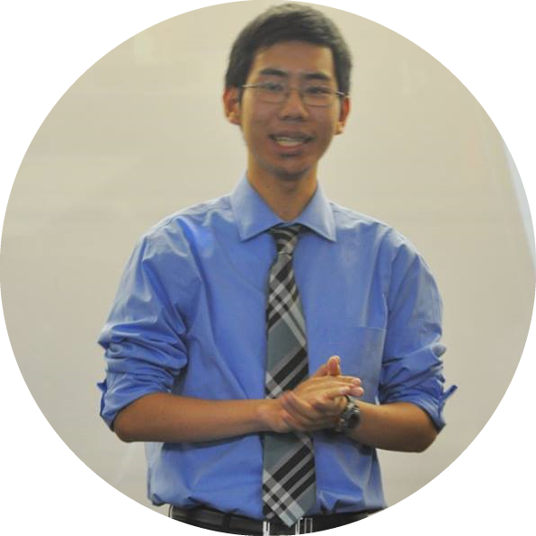

Hi there! My name is Christopher Wong and I graduated from UC Davis in 2017 with a double major in Mathematical and Scientific Computation (BS) and General Statistics (BS). On my portfolio you will find projects that I have worked on using programming languages such as R, Python, Matlab and tools such as Tableau, SQL/MySQL, and Excel.

In my spare time I enjoy learning new programming languages (currently working on a SQL project), playing the piano, and PC gaming.
