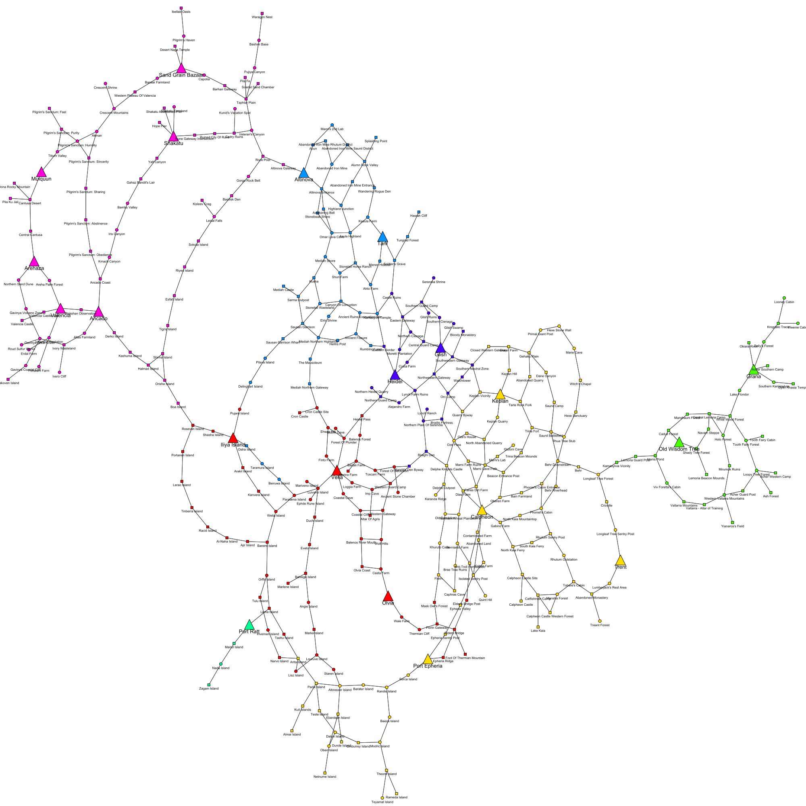
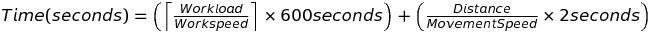
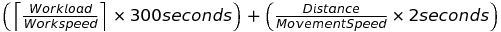
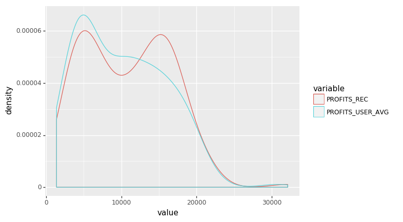
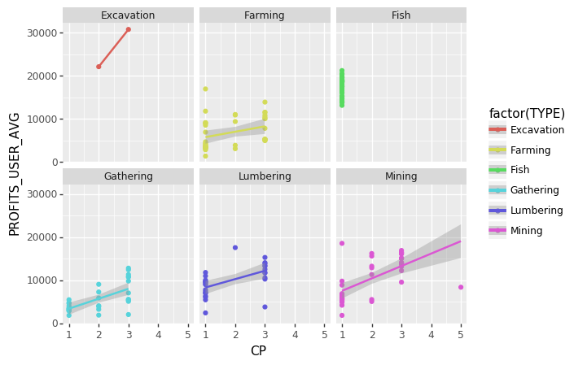
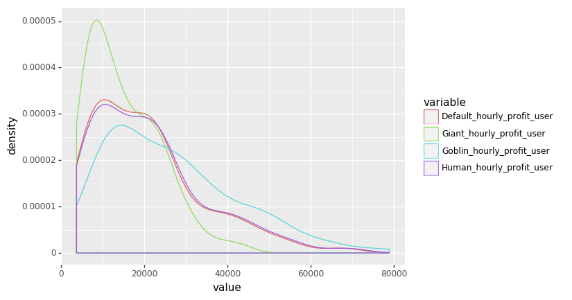
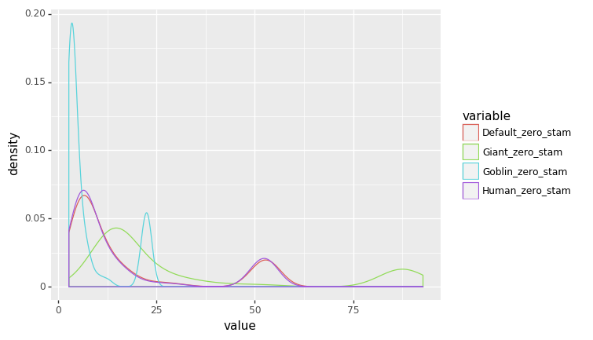

# Using scraped data
Now we can analyze.


```python
# Import packages
import MySQLdb
import numpy as np
import pandas as pd
import re

# Create connection to MySQL
conn = MySQLdb.connect(host= "localhost",
                  user="yourusername",
                  passwd="yourpassword",
                  db="bdodae")

x = conn.cursor()
```


```python
pd.options.display.max_rows = 6
# Table 'node' that we obtained from web scraping bdodae.com
node = pd.read_sql('SELECT * FROM node', con = conn)
node
```


<div>
<style scoped>
    .dataframe tbody tr th:only-of-type {
        vertical-align: middle;
    }

    .dataframe tbody tr th {
        vertical-align: top;
    }

    .dataframe thead th {
        text-align: right;
    }
</style>
<table border="1" class="dataframe">
  <thead>
    <tr style="text-align: right;">
      <th></th>
      <th>NODE_ID</th>
      <th>NAME</th>
      <th>CP</th>
      <th>AREA</th>
      <th>TYPE</th>
      <th>REGION_MOD_PERCENT</th>
      <th>CONNECTIONS</th>
    </tr>
  </thead>
  <tbody>
    <tr>
      <th>0</th>
      <td>1</td>
      <td>Abandoned Iron Mine</td>
      <td>2</td>
      <td>Mediah</td>
      <td>Worker Node</td>
      <td>0.0</td>
      <td>Abandoned Iron Mine Saunil District, Abandoned...</td>
    </tr>
    <tr>
      <th>1</th>
      <td>2</td>
      <td>Abandoned Iron Mine Entrance</td>
      <td>1</td>
      <td>Mediah</td>
      <td>Connection Node</td>
      <td>NaN</td>
      <td>Highland Junction, Alumn Rock Valley</td>
    </tr>
    <tr>
      <th>2</th>
      <td>3</td>
      <td>Abandoned Iron Mine Rhutum District</td>
      <td>1</td>
      <td>Mediah</td>
      <td>Connection Node</td>
      <td>NaN</td>
      <td>Abandoned Iron Mine, Abun</td>
    </tr>
    <tr>
      <th>...</th>
      <td>...</td>
      <td>...</td>
      <td>...</td>
      <td>...</td>
      <td>...</td>
      <td>...</td>
      <td>...</td>
    </tr>
    <tr>
      <th>356</th>
      <td>357</td>
      <td>Yalt Canyon</td>
      <td>1</td>
      <td>Valencia</td>
      <td>Connection Node</td>
      <td>NaN</td>
      <td>Shakatu, Gahaz Bandit's Lair</td>
    </tr>
    <tr>
      <th>357</th>
      <td>358</td>
      <td>Yianaros's Field</td>
      <td>1</td>
      <td>Kamasylvia</td>
      <td>Connection Node</td>
      <td>NaN</td>
      <td>Western Valtarra Mountains</td>
    </tr>
    <tr>
      <th>358</th>
      <td>359</td>
      <td>Zagam Island</td>
      <td>1</td>
      <td>Margoria</td>
      <td>Connection Node</td>
      <td>NaN</td>
      <td>Nada Island</td>
    </tr>
  </tbody>
</table>
<p>359 rows × 7 columns</p>
</div>


```python
# Table 'subnode' that we obtained from web scraping bdodae.com
subnode = pd.read_sql('SELECT * FROM subnode', con = conn)
subnode
```


<div>
<style scoped>
    .dataframe tbody tr th:only-of-type {
        vertical-align: middle;
    }

    .dataframe tbody tr th {
        vertical-align: top;
    }

    .dataframe thead th {
        text-align: right;
    }
</style>
<table border="1" class="dataframe">
  <thead>
    <tr style="text-align: right;">
      <th></th>
      <th>SUBNODE_ID</th>
      <th>NAME</th>
      <th>CP</th>
      <th>BASE_WORKLOAD</th>
      <th>CURRENT_WORKLOAD</th>
      <th>ITEM1</th>
      <th>ITEM2</th>
      <th>ITEM3</th>
      <th>ITEM4</th>
      <th>YIELD1</th>
      <th>YIELD2</th>
      <th>YIELD3</th>
      <th>YIELD4</th>
      <th>DISTANCE1</th>
      <th>DISTANCE2</th>
      <th>DISTANCE3</th>
      <th>CITY1</th>
      <th>CITY2</th>
      <th>CITY3</th>
    </tr>
  </thead>
  <tbody>
    <tr>
      <th>0</th>
      <td>1</td>
      <td>Abandoned Iron Mine - Mining.1</td>
      <td>3</td>
      <td>200</td>
      <td>250</td>
      <td>Zinc Ore</td>
      <td>Powder Of Time</td>
      <td>Platinum Ore</td>
      <td>None</td>
      <td>7.86</td>
      <td>1.86</td>
      <td>0.95</td>
      <td>NaN</td>
      <td>1113</td>
      <td>2063</td>
      <td>NaN</td>
      <td>Altinova</td>
      <td>Tarif</td>
      <td>None</td>
    </tr>
    <tr>
      <th>1</th>
      <td>2</td>
      <td>Abandoned Iron Mine - Mining.2</td>
      <td>3</td>
      <td>500</td>
      <td>100</td>
      <td>Iron Ore</td>
      <td>Powder Of Darkness</td>
      <td>Rough Black Crystal</td>
      <td>None</td>
      <td>10.53</td>
      <td>1.80</td>
      <td>1.08</td>
      <td>NaN</td>
      <td>1113</td>
      <td>2063</td>
      <td>NaN</td>
      <td>Altinova</td>
      <td>Tarif</td>
      <td>None</td>
    </tr>
    <tr>
      <th>2</th>
      <td>3</td>
      <td>Ahto Farm - Farming.1</td>
      <td>2</td>
      <td>200</td>
      <td>100</td>
      <td>Cotton</td>
      <td>Cotton Yarn</td>
      <td>None</td>
      <td>None</td>
      <td>12.53</td>
      <td>0.85</td>
      <td>NaN</td>
      <td>NaN</td>
      <td>702</td>
      <td>2000</td>
      <td>2325.0</td>
      <td>Tarif</td>
      <td>Heidel</td>
      <td>Altinova</td>
    </tr>
    <tr>
      <th>...</th>
      <td>...</td>
      <td>...</td>
      <td>...</td>
      <td>...</td>
      <td>...</td>
      <td>...</td>
      <td>...</td>
      <td>...</td>
      <td>...</td>
      <td>...</td>
      <td>...</td>
      <td>...</td>
      <td>...</td>
      <td>...</td>
      <td>...</td>
      <td>...</td>
      <td>...</td>
      <td>...</td>
      <td>...</td>
    </tr>
    <tr>
      <th>169</th>
      <td>170</td>
      <td>Weenie Cabin - Gathering.1</td>
      <td>2</td>
      <td>140</td>
      <td>140</td>
      <td>Volcanic Umbrella Mushroom</td>
      <td>Green Pendulous Mushroom</td>
      <td>None</td>
      <td>None</td>
      <td>7.70</td>
      <td>6.90</td>
      <td>NaN</td>
      <td>NaN</td>
      <td>1608</td>
      <td>3025</td>
      <td>6005.0</td>
      <td>Grana</td>
      <td>Old Wisdom Tree</td>
      <td>Trent</td>
    </tr>
    <tr>
      <th>170</th>
      <td>171</td>
      <td>Weita Island - Fish Drying Yard.1</td>
      <td>1</td>
      <td>2400</td>
      <td>1200</td>
      <td>Dried Surfperch</td>
      <td>Dried Bluefish</td>
      <td>Dried Maomao</td>
      <td>Dried Nibbler</td>
      <td>3.60</td>
      <td>1.80</td>
      <td>0.90</td>
      <td>0.08</td>
      <td>1620</td>
      <td>3291</td>
      <td>3340.0</td>
      <td>Iliya Island</td>
      <td>Velia</td>
      <td>Olvia</td>
    </tr>
    <tr>
      <th>171</th>
      <td>172</td>
      <td>Wolf Hills - Lumbering.1</td>
      <td>1</td>
      <td>150</td>
      <td>100</td>
      <td>Ash Timber</td>
      <td>None</td>
      <td>None</td>
      <td>None</td>
      <td>4.43</td>
      <td>NaN</td>
      <td>NaN</td>
      <td>NaN</td>
      <td>340</td>
      <td>1902</td>
      <td>NaN</td>
      <td>Olvia</td>
      <td>Velia</td>
      <td>None</td>
    </tr>
  </tbody>
</table>
<p>172 rows × 19 columns</p>
</div>


```python
# Get minimum distance from all 3 distance columns
min_col = subnode[["DISTANCE1", "DISTANCE2", "DISTANCE3"]].idxmin(axis=1)

# Get corresponding closest city from minimum distance
min_city = []
min_dist = []
for x, i in zip(min_col, range(len(min_col))):
    num = re.search('\d', x).group(0)
    min_city.append(subnode.iloc[i, :]["CITY" + str(num)])
    min_dist.append(subnode.iloc[i, :][x])

# New columns that we will join onto 'node'
subnode["MIN_DIST"] = min_dist
subnode["MIN_CITY"] = min_city
```


```python
# Take the names from 'subnode' and cut off the ending to obtain the main node name
subnode["NODE_NAME"] = subnode["NAME"]
for name, i in zip(subnode["NODE_NAME"], range(np.shape(subnode)[0])):
    name = re.split(' - ', name)[0]
    subnode.at[i, "NODE_NAME"] = name
```


```python
# Left-joining onto node to include distance and city information for worker nodes
node_dist = pd.merge(node, subnode[["NODE_NAME", "MIN_DIST", "MIN_CITY"]].drop_duplicates("NODE_NAME"), how = "left", left_on = "NAME", right_on = "NODE_NAME")
node_dist
```


<div>
<style scoped>
    .dataframe tbody tr th:only-of-type {
        vertical-align: middle;
    }

    .dataframe tbody tr th {
        vertical-align: top;
    }

    .dataframe thead th {
        text-align: right;
    }
</style>
<table border="1" class="dataframe">
  <thead>
    <tr style="text-align: right;">
      <th></th>
      <th>NODE_ID</th>
      <th>NAME</th>
      <th>CP</th>
      <th>AREA</th>
      <th>TYPE</th>
      <th>REGION_MOD_PERCENT</th>
      <th>CONNECTIONS</th>
      <th>NODE_NAME</th>
      <th>MIN_DIST</th>
      <th>MIN_CITY</th>
    </tr>
  </thead>
  <tbody>
    <tr>
      <th>0</th>
      <td>1</td>
      <td>Abandoned Iron Mine</td>
      <td>2</td>
      <td>Mediah</td>
      <td>Worker Node</td>
      <td>0.0</td>
      <td>Abandoned Iron Mine Saunil District, Abandoned...</td>
      <td>Abandoned Iron Mine</td>
      <td>1113.0</td>
      <td>Altinova</td>
    </tr>
    <tr>
      <th>1</th>
      <td>2</td>
      <td>Abandoned Iron Mine Entrance</td>
      <td>1</td>
      <td>Mediah</td>
      <td>Connection Node</td>
      <td>NaN</td>
      <td>Highland Junction, Alumn Rock Valley</td>
      <td>NaN</td>
      <td>NaN</td>
      <td>NaN</td>
    </tr>
    <tr>
      <th>2</th>
      <td>3</td>
      <td>Abandoned Iron Mine Rhutum District</td>
      <td>1</td>
      <td>Mediah</td>
      <td>Connection Node</td>
      <td>NaN</td>
      <td>Abandoned Iron Mine, Abun</td>
      <td>NaN</td>
      <td>NaN</td>
      <td>NaN</td>
    </tr>
    <tr>
      <th>...</th>
      <td>...</td>
      <td>...</td>
      <td>...</td>
      <td>...</td>
      <td>...</td>
      <td>...</td>
      <td>...</td>
      <td>...</td>
      <td>...</td>
      <td>...</td>
    </tr>
    <tr>
      <th>356</th>
      <td>357</td>
      <td>Yalt Canyon</td>
      <td>1</td>
      <td>Valencia</td>
      <td>Connection Node</td>
      <td>NaN</td>
      <td>Shakatu, Gahaz Bandit's Lair</td>
      <td>NaN</td>
      <td>NaN</td>
      <td>NaN</td>
    </tr>
    <tr>
      <th>357</th>
      <td>358</td>
      <td>Yianaros's Field</td>
      <td>1</td>
      <td>Kamasylvia</td>
      <td>Connection Node</td>
      <td>NaN</td>
      <td>Western Valtarra Mountains</td>
      <td>NaN</td>
      <td>NaN</td>
      <td>NaN</td>
    </tr>
    <tr>
      <th>358</th>
      <td>359</td>
      <td>Zagam Island</td>
      <td>1</td>
      <td>Margoria</td>
      <td>Connection Node</td>
      <td>NaN</td>
      <td>Nada Island</td>
      <td>NaN</td>
      <td>NaN</td>
      <td>NaN</td>
    </tr>
  </tbody>
</table>
<p>359 rows × 10 columns</p>
</div>


# igraph
Visualizing our node system.


```python
# Import packages
import itertools
import igraph

# Create graph
g = igraph.Graph()
# Generates unnamed vertices for graph
g.add_vertices(np.shape(node)[0])
```


```python
# Generates edges for graph
g.vs["name"] = node["NAME"]
for name, x, cp in zip(node_dist["NAME"], node_dist["CONNECTIONS"], node_dist["CP"]):
    # Splits the connections from 'node' into parts
    conn = re.split(', ', x)
    n_conn = len(conn)
    # Adds edges between main node and its connections
    g.add_edges(zip(itertools.repeat(name, n_conn), conn))

# Adding vertex attributes
g.vs["name"] = node["NAME"]
g.vs["area"] = node["AREA"]
g.vs["type"] = node["TYPE"]
g.vs["cp"] = node["CP"]
# Checking to see if our graph has the correct number of vertices and edges
igraph.summary(g)
```

    IGRAPH UN-T 359 886 -- 
    + attr: area (v), cp (v), name (v), type (v)
    


```python
# Import cairo to display igraph
import cairo
layout = g.layout_kamada_kawai()

# Dictionaries defining visual styling for the graph
size_dict = {"Connection Node": 6, "Town Node": 25, "Worker Node": 7}
shape_dict = {"Connection Node" : "rectangle", "Town Node" : "triangle-up", "Worker Node" : "circle"}
color_dict = {"Balenos" : igraph.RainbowPalette(len(set(node["AREA"])))[0],
              "Calpheon" : igraph.RainbowPalette(len(set(node["AREA"])))[1],
              "Kamasylvia" : igraph.RainbowPalette(len(set(node["AREA"])))[2],
              "Margoria" : igraph.RainbowPalette(len(set(node["AREA"])))[3],
              "Mediah" : igraph.RainbowPalette(len(set(node["AREA"])))[4],
              "Serendia" : igraph.RainbowPalette(len(set(node["AREA"])))[5],
              "Valencia" : igraph.RainbowPalette(len(set(node["AREA"])))[6]}
label_size_dict = {"Connection Node": 8, "Town Node": 13, "Worker Node": 8}
label_dist_dict = {"Connection Node": 2, "Town Node": 1, "Worker Node": 2}

# Configure visual styling and plot
visual_style = {}
visual_style["vertex_size"] = [size_dict[type_] for type_ in g.vs["type"]]
visual_style["vertex_shape"] = [shape_dict[type_] for type_ in g.vs["type"]]
visual_style["vertex_color"] = [color_dict[area] for area in g.vs["area"]]
visual_style["vertex_label"] = g.vs["name"]
visual_style["vertex_label_size"] = [label_size_dict[type_] for type_ in g.vs["type"]]
visual_style["vertex_label_dist"] = [label_dist_dict[type_] for type_ in g.vs["type"]]
visual_style["edge_curved"] = False
visual_style["layout"] = layout
visual_style["bbox"] = (2000, 2000)
visual_style["margin"] = 20
### Plot without saving
igraph.plot(g, **visual_style)

### Saves to file "node_map.png"
# igraph.plot(g, "node_map.png", **visual_style)
```





# Calculate value of each subnode
Using the worker mechanics explained by [Black Desert Analytics](https://blackdesertanalytics.netlify.com/miscellaneous/workers/) I can determine a value for each subnode given some worker.


* Work Speed and Work Load
    - Work loads for nodes work is what most players will call ticks. Your ticks are calculated by doing Workload/Workspeed and then rounded UP to the nearest whole number (4.1=5). Each tick takes 10 minutes (5 minutes for crates).
    
* Movement Speed and Distance
    - This is simply determined by (distance/movement speed) $\times$ 2 $\times$ Seconds. The reason for the x2 is the worker needs to travel to the node and then travel back to his home base to deposit what he gathered.
    - The final cycle time is simply these two formulas added up.

Thus, the total time taken for a worker to finish one cycle is given by:
$$ Time (seconds) = \left(\left\lceil \frac{Workload}{Workspeed} \right\rceil \times 600 seconds\right) + \left(\frac{Distance}{Movement Speed} \times 2 seconds\right) $$


For crates we have:
$$ \left(\left\lceil \frac{Workload}{Workspeed} \right\rceil \times 300 seconds\right) + \left(\frac{Distance}{Movement Speed} \times 2 seconds\right) $$


```python
# Import packages
import MySQLdb
import numpy as np
import pandas as pd
import re
import math

# Create connection to MySQL
conn = MySQLdb.connect(host= "localhost",
                  user="yourusername",
                  passwd="yourpassword",
                  db="bdodae")

x = conn.cursor()

pd.options.display.max_rows = 6
# Table 'node' that we obtained from web scraping bdodae.com
node = pd.read_sql('SELECT * FROM node', con = conn)

# Table 'subnode' that we obtained from web scraping bdodae.com
subnode = pd.read_sql('SELECT * FROM subnode', con = conn)

# Table 'prices' that we obtained from web scraping bdodae.com
prices = pd.read_sql('SELECT * FROM prices', con = conn)
```


```python
# Worker dictionary containing 4 types of workers
# Workers except Default are base artisan-level workers
worker_dict = {'Default' : {'Name' : 'Default', 'Workspeed' : 100, 'Movespeed' : 4.25, 'Stamina' : 23},
               'Goblin' : {'Name' : 'Goblin', 'Workspeed' : 150, 'Movespeed' : 7.5, 'Stamina' : 15},
               'Human' : {'Name' : 'Human', 'Workspeed' : 105, 'Movespeed' : 4.5, 'Stamina' : 23},
               'Giant' : {'Name' : 'Giant', 'Workspeed' : 95, 'Movespeed' : 3.75, 'Stamina' : 35}}

# Calculate worker profits/gains for each node and put it in the subnode dataframe
items = subnode[["ITEM1", "ITEM2", "ITEM3", "ITEM4"]]
yields = subnode[["YIELD1", "YIELD2", "YIELD3", "YIELD4"]]
total_profits_user_avg_list = []
total_profits_rec_list = []
for i in range(len(subnode)):
    workload = subnode.iloc[i, :]["CURRENT_WORKLOAD"]
    total_profits_user_avg = 0
    total_profits_rec = 0
    for item, yield_ in zip(items.iloc[i, :], yields.iloc[i, :]):
        # If the item and yield exists (i.e. is not None)
        if(item and yield_):
            user_item_price = int(prices[prices["ITEM"] == item]["USER_AVERAGE"])
            recent_item_price = int(prices[prices["ITEM"] == item]["RECENT_VALUE"])
            total_profits_user_avg += yield_ * user_item_price
            total_profits_rec += yield_ * recent_item_price
    total_profits_user_avg_list.append(total_profits_user_avg)
    total_profits_rec_list.append(total_profits_rec)

# Profits generated per worker cycle
# We want to standardize this to profit per hour
profit = subnode[["SUBNODE_ID", "NAME", "CP", "BASE_WORKLOAD", "CURRENT_WORKLOAD", "MIN_DIST"]].copy()
profit["PROFITS_USER_AVG"] = total_profits_user_avg_list
profit["PROFITS_REC"] = total_profits_rec_list
```


```python
# Calculate per hour income for each worker
# Pass arguments as worker_profit(**worker_dict['WORKER'])
def get_cycle_time(Workload, Workspeed, Distance, Movespeed):
    # Return time in minutes
    return(((math.ceil(Workload / Workspeed) * 600) + (Distance / Movespeed) * 2) / 60)
```


```python
hourly_profit_dict = {}
# Calculates hourly profit for all subnodes for one worker
def get_hourly_profit(Name, Workspeed, Movespeed, Stamina):
    hourly_profit_user_list = []
    hourly_profit_rec_list = []
    for workload, distance, user, recent in zip(profit["CURRENT_WORKLOAD"],
                                                profit["MIN_DIST"],
                                                profit["PROFITS_USER_AVG"],
                                                profit["PROFITS_REC"]):
        # Cycle time in minutes
        cycle_time = get_cycle_time(workload, Workspeed, distance, Movespeed)
        cycles_per_hour = 60 / cycle_time
        hourly_profit_user = cycles_per_hour * user
        hourly_profit_rec = cycles_per_hour * recent
        hourly_profit_user_list.append(hourly_profit_user)
        hourly_profit_rec_list.append(hourly_profit_rec)
    hourly_profit_dict[Name + '_hourly_profit_user'] = hourly_profit_user_list
    hourly_profit_dict[Name + '_hourly_profit_rec'] = hourly_profit_rec_list
```


```python
# Loop that gets hourly profit for all workers
for worker in worker_dict:
    get_hourly_profit(**worker_dict[worker])

# Writes our dictionary with worker profits into our 'profit' dataframe
for col in hourly_profit_dict:
    profit[col] = hourly_profit_dict[col]
```

# Using plotnine and ggplot
Similar to R's ggplot2


```python
import pandas as pd
import numpy as np
from plotnine import *
```


```python
import warnings
warnings.filterwarnings('ignore')
```


```python
profit
```


<div>
<style scoped>
    .dataframe tbody tr th:only-of-type {
        vertical-align: middle;
    }

    .dataframe tbody tr th {
        vertical-align: top;
    }

    .dataframe thead th {
        text-align: right;
    }
</style>
<table border="1" class="dataframe">
  <thead>
    <tr style="text-align: right;">
      <th></th>
      <th>SUBNODE_ID</th>
      <th>NAME</th>
      <th>CP</th>
      <th>BASE_WORKLOAD</th>
      <th>CURRENT_WORKLOAD</th>
      <th>MIN_DIST</th>
      <th>PROFITS_USER_AVG</th>
      <th>PROFITS_REC</th>
      <th>Default_hourly_profit_user</th>
      <th>Default_hourly_profit_rec</th>
      <th>Goblin_hourly_profit_user</th>
      <th>Goblin_hourly_profit_rec</th>
      <th>Human_hourly_profit_user</th>
      <th>Human_hourly_profit_rec</th>
      <th>Giant_hourly_profit_user</th>
      <th>Giant_hourly_profit_rec</th>
      <th>TYPE</th>
    </tr>
  </thead>
  <tbody>
    <tr>
      <th>0</th>
      <td>1</td>
      <td>Abandoned Iron Mine - Mining.1</td>
      <td>3</td>
      <td>200</td>
      <td>250</td>
      <td>1113</td>
      <td>13732.70</td>
      <td>16304.87</td>
      <td>21274.839004</td>
      <td>25259.671021</td>
      <td>33028.941742</td>
      <td>39215.347408</td>
      <td>21544.619407</td>
      <td>25579.981987</td>
      <td>20654.127674</td>
      <td>24522.698864</td>
      <td>Mining</td>
    </tr>
    <tr>
      <th>1</th>
      <td>2</td>
      <td>Abandoned Iron Mine - Mining.2</td>
      <td>3</td>
      <td>500</td>
      <td>100</td>
      <td>1113</td>
      <td>12188.25</td>
      <td>14125.41</td>
      <td>39045.273241</td>
      <td>45250.999372</td>
      <td>48926.962533</td>
      <td>56703.251561</td>
      <td>40083.160780</td>
      <td>46453.845311</td>
      <td>24463.481267</td>
      <td>28351.625781</td>
      <td>Mining</td>
    </tr>
    <tr>
      <th>2</th>
      <td>3</td>
      <td>Ahto Farm - Farming.1</td>
      <td>2</td>
      <td>200</td>
      <td>100</td>
      <td>702</td>
      <td>11028.27</td>
      <td>13413.30</td>
      <td>42673.882398</td>
      <td>51902.754173</td>
      <td>50434.161585</td>
      <td>61341.310976</td>
      <td>43532.644737</td>
      <td>52947.236842</td>
      <td>25217.080793</td>
      <td>30670.655488</td>
      <td>Farming</td>
    </tr>
    <tr>
      <th>...</th>
      <td>...</td>
      <td>...</td>
      <td>...</td>
      <td>...</td>
      <td>...</td>
      <td>...</td>
      <td>...</td>
      <td>...</td>
      <td>...</td>
      <td>...</td>
      <td>...</td>
      <td>...</td>
      <td>...</td>
      <td>...</td>
      <td>...</td>
      <td>...</td>
      <td>...</td>
    </tr>
    <tr>
      <th>169</th>
      <td>170</td>
      <td>Weenie Cabin - Gathering.1</td>
      <td>2</td>
      <td>140</td>
      <td>140</td>
      <td>1608</td>
      <td>9022.60</td>
      <td>11337.80</td>
      <td>16600.021645</td>
      <td>20859.588745</td>
      <td>31572.083981</td>
      <td>39673.483670</td>
      <td>16964.498607</td>
      <td>21317.590529</td>
      <td>15786.041991</td>
      <td>19836.741835</td>
      <td>Gathering</td>
    </tr>
    <tr>
      <th>170</th>
      <td>171</td>
      <td>Weita Island - Fish Drying Yard.1</td>
      <td>1</td>
      <td>2400</td>
      <td>1200</td>
      <td>1620</td>
      <td>14364.32</td>
      <td>15288.86</td>
      <td>6494.506383</td>
      <td>6912.516489</td>
      <td>9883.706422</td>
      <td>10519.857798</td>
      <td>6529.236364</td>
      <td>6949.481818</td>
      <td>5968.554017</td>
      <td>6352.711911</td>
      <td>Fish</td>
    </tr>
    <tr>
      <th>171</th>
      <td>172</td>
      <td>Wolf Hills - Lumbering.1</td>
      <td>1</td>
      <td>150</td>
      <td>100</td>
      <td>340</td>
      <td>2387.77</td>
      <td>2613.70</td>
      <td>11310.489474</td>
      <td>12380.684211</td>
      <td>12445.905405</td>
      <td>13623.532819</td>
      <td>11444.341420</td>
      <td>12527.201183</td>
      <td>6222.952703</td>
      <td>6811.766409</td>
      <td>Lumbering</td>
    </tr>
  </tbody>
</table>
<p>172 rows × 17 columns</p>
</div>


```python
# Get subnode type from its name
type_list = []
for name in profit['NAME']:
    type_ = re.split(' - ', name)[1]
    type_ = re.search('\w+', type_).group(0)
    type_list.append(type_)
    
profit['TYPE'] = type_list
```


```python
# Density plot of subnode cycle profits
profit_cycle = pd.melt(profit[["PROFITS_USER_AVG", "PROFITS_REC", "TYPE"]], id_vars = ['TYPE'])
(ggplot(profit_cycle, aes('value', color = 'variable'))
      + geom_density())
```





    <ggplot: (-9223371918799307355)>


```python
# Comparison of subnode cycle profits vs CP cost for different types of subnode materials
(ggplot(profit, aes(x = 'CP', y = 'PROFITS_USER_AVG', color = 'factor(TYPE)'))
+ geom_point()
+ stat_smooth(method='lm')
+ facet_wrap('~TYPE'))
# We see there is a general increasing trend: the more CP the subnode costs, the greater the profit
# For Excavation the sample size is too small, and Fish is a special case with only 1CP subnode costs
```





    <ggplot: (118055225103)>


```python
# Density plot of hourly profit for each worker type
profit_hourly = pd.melt(profit[["Default_hourly_profit_user", "Goblin_hourly_profit_user",
                                "Human_hourly_profit_user", "Giant_hourly_profit_user", "TYPE"]], id_vars = ['TYPE'])
(ggplot(profit_hourly, aes('value', color = 'variable'))
      + geom_density())
# Giants make the least per hour and goblins make the most, as expected
```





    <ggplot: (-9223371918799641333)>


### Working in worker stamina for extended periods of time
One point of worker stamina is consumed per cycle of work completed.


```python
# Calculate per hour income for each worker
# Pass arguments as worker_profit(**worker_dict['WORKER'])
def get_cycle_time(Workload, Workspeed, Distance, Movespeed):
    # Return time in minutes
    return(((math.ceil(Workload / Workspeed) * 600) + (Distance / Movespeed) * 2) / 60)
```


```python
# Calculate stamina usage
worker_exhaust_dict = {}
def get_worker_exhaust(Name, Workspeed, Movespeed, Stamina):
    worker_exhaust_list = []
    for workload, distance in zip(profit["CURRENT_WORKLOAD"], profit["MIN_DIST"]):
        # Cycle time in minutes
        cycle_time = get_cycle_time(workload, Workspeed, distance, Movespeed)
        # Time until zero stamina in minutes
        zero_stamina_time = cycle_time * Stamina
        zero_stamina_time_hr = zero_stamina_time / 60
        worker_exhaust_list.append(zero_stamina_time_hr)
    worker_exhaust_dict[Name + '_zero_stam'] = worker_exhaust_list
```


```python
# Loop that gets stamina usage for all workers
for worker in worker_dict:
    get_worker_exhaust(**worker_dict[worker])

# Writes our dictionary with worker profits into our 'profit' dataframe
for col in worker_exhaust_dict:
    profit[col] = worker_exhaust_dict[col]
```


```python
profit
```


<div>
<style scoped>
    .dataframe tbody tr th:only-of-type {
        vertical-align: middle;
    }

    .dataframe tbody tr th {
        vertical-align: top;
    }

    .dataframe thead th {
        text-align: right;
    }
</style>
<table border="1" class="dataframe">
  <thead>
    <tr style="text-align: right;">
      <th></th>
      <th>SUBNODE_ID</th>
      <th>NAME</th>
      <th>CP</th>
      <th>BASE_WORKLOAD</th>
      <th>CURRENT_WORKLOAD</th>
      <th>MIN_DIST</th>
      <th>PROFITS_USER_AVG</th>
      <th>PROFITS_REC</th>
      <th>Default_hourly_profit_user</th>
      <th>Default_hourly_profit_rec</th>
      <th>Goblin_hourly_profit_user</th>
      <th>Goblin_hourly_profit_rec</th>
      <th>Human_hourly_profit_user</th>
      <th>Human_hourly_profit_rec</th>
      <th>Giant_hourly_profit_user</th>
      <th>Giant_hourly_profit_rec</th>
      <th>Default_zero_stam</th>
      <th>Goblin_zero_stam</th>
      <th>Human_zero_stam</th>
      <th>Giant_zero_stam</th>
    </tr>
  </thead>
  <tbody>
    <tr>
      <th>0</th>
      <td>1</td>
      <td>Abandoned Iron Mine - Mining.1</td>
      <td>3</td>
      <td>200</td>
      <td>250</td>
      <td>1113</td>
      <td>13732.70</td>
      <td>16304.87</td>
      <td>21274.839004</td>
      <td>25259.671021</td>
      <td>33028.941742</td>
      <td>39215.347408</td>
      <td>21544.619407</td>
      <td>25579.981987</td>
      <td>20654.127674</td>
      <td>24522.698864</td>
      <td>14.846275</td>
      <td>6.236667</td>
      <td>14.660370</td>
      <td>23.271111</td>
    </tr>
    <tr>
      <th>1</th>
      <td>2</td>
      <td>Abandoned Iron Mine - Mining.2</td>
      <td>3</td>
      <td>500</td>
      <td>100</td>
      <td>1113</td>
      <td>12188.25</td>
      <td>14125.41</td>
      <td>39045.273241</td>
      <td>45250.999372</td>
      <td>48926.962533</td>
      <td>56703.251561</td>
      <td>40083.160780</td>
      <td>46453.845311</td>
      <td>24463.481267</td>
      <td>28351.625781</td>
      <td>7.179608</td>
      <td>3.736667</td>
      <td>6.993704</td>
      <td>17.437778</td>
    </tr>
    <tr>
      <th>2</th>
      <td>3</td>
      <td>Ahto Farm - Farming.1</td>
      <td>2</td>
      <td>200</td>
      <td>100</td>
      <td>702</td>
      <td>11028.27</td>
      <td>13413.30</td>
      <td>42673.882398</td>
      <td>51902.754173</td>
      <td>50434.161585</td>
      <td>61341.310976</td>
      <td>43532.644737</td>
      <td>52947.236842</td>
      <td>25217.080793</td>
      <td>30670.655488</td>
      <td>5.943922</td>
      <td>3.280000</td>
      <td>5.826667</td>
      <td>15.306667</td>
    </tr>
    <tr>
      <th>...</th>
      <td>...</td>
      <td>...</td>
      <td>...</td>
      <td>...</td>
      <td>...</td>
      <td>...</td>
      <td>...</td>
      <td>...</td>
      <td>...</td>
      <td>...</td>
      <td>...</td>
      <td>...</td>
      <td>...</td>
      <td>...</td>
      <td>...</td>
      <td>...</td>
      <td>...</td>
      <td>...</td>
      <td>...</td>
      <td>...</td>
    </tr>
    <tr>
      <th>169</th>
      <td>170</td>
      <td>Weenie Cabin - Gathering.1</td>
      <td>2</td>
      <td>140</td>
      <td>140</td>
      <td>1608</td>
      <td>9022.60</td>
      <td>11337.80</td>
      <td>16600.021645</td>
      <td>20859.588745</td>
      <td>31572.083981</td>
      <td>39673.483670</td>
      <td>16964.498607</td>
      <td>21317.590529</td>
      <td>15786.041991</td>
      <td>19836.741835</td>
      <td>12.501176</td>
      <td>4.286667</td>
      <td>12.232593</td>
      <td>20.004444</td>
    </tr>
    <tr>
      <th>170</th>
      <td>171</td>
      <td>Weita Island - Fish Drying Yard.1</td>
      <td>1</td>
      <td>2400</td>
      <td>1200</td>
      <td>1620</td>
      <td>14364.32</td>
      <td>15288.86</td>
      <td>6494.506383</td>
      <td>6912.516489</td>
      <td>9883.706422</td>
      <td>10519.857798</td>
      <td>6529.236364</td>
      <td>6949.481818</td>
      <td>5968.554017</td>
      <td>6352.711911</td>
      <td>50.870588</td>
      <td>21.800000</td>
      <td>50.600000</td>
      <td>84.233333</td>
    </tr>
    <tr>
      <th>171</th>
      <td>172</td>
      <td>Wolf Hills - Lumbering.1</td>
      <td>1</td>
      <td>150</td>
      <td>100</td>
      <td>340</td>
      <td>2387.77</td>
      <td>2613.70</td>
      <td>11310.489474</td>
      <td>12380.684211</td>
      <td>12445.905405</td>
      <td>13623.532819</td>
      <td>11444.341420</td>
      <td>12527.201183</td>
      <td>6222.952703</td>
      <td>6811.766409</td>
      <td>4.855556</td>
      <td>2.877778</td>
      <td>4.798765</td>
      <td>13.429630</td>
    </tr>
  </tbody>
</table>
<p>172 rows × 20 columns</p>
</div>


```python
# Density plot of time until exhaustion (0 stamina) for each worker type
profit_stamina = pd.melt(profit[["Default_zero_stam", "Goblin_zero_stam",
                                "Human_zero_stam", "Giant_zero_stam", "TYPE"]], id_vars = ['TYPE'])
(ggplot(profit_stamina, aes('value', color = 'variable'))
      + geom_density())
```





    <ggplot: (118053225357)>


