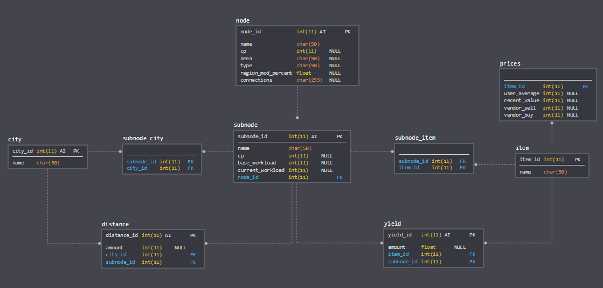

# Schema
<center></center>

# Web Scraping
I web scraped the website [bdodae.com](https://www.bdodae.com/) for data to use for my project. Since I am optimizing profits I need item values and information about the nodes.

### Tools of choice
* Python because I want to learn another language for data analysis (having used R throughout college)
* Selenium because [bdodae.com](https://www.bdodae.com/) is written in JavaScript as opposed to HTML. This means that the website is dynamic and has to be loaded before web scraping.
* BeautifulSoup to parse the webpage once it is loaded in Selenium.
* MySQLdb because I want to save the scraped information to a MySQL database that I can pull information from later.

# Scraping item values
[Item page](https://www.bdodae.com/nodes/index.php?page=items)


```python
# Import packages
from selenium import webdriver
from selenium.webdriver.common.keys import Keys
from selenium.webdriver.common.by import By
from selenium.webdriver.support.ui import WebDriverWait
from selenium.webdriver.support import expected_conditions as EC
from selenium.webdriver.support.ui import Select
from bs4 import BeautifulSoup
import re
import pandas as pd
import os
import time

# Server Connection to MySQL:
import MySQLdb
conn = MySQLdb.connect(host= "localhost",
                  user="yourusername",
                  passwd="yourpassword",
                  db="bdodae_new")

x = conn.cursor()

# Create table for items
try:
    x.execute(
    """
    CREATE TABLE IF NOT EXISTS item (
    item_id INT NOT NULL PRIMARY KEY,
    name CHAR(50) NOT NULL)
    """)
    conn.commit()
except:
    conn.rollback()

# Create table for prices
try:
    x.execute(
    """
    CREATE TABLE IF NOT EXISTS prices (
    item_id INT NOT NULL,
    FOREIGN KEY (item_id) REFERENCES item(item_id),
    user_average INT,
    recent_value INT,
    vendor_sell INT,
    vendor_buy INT DEFAULT NULL)
    """)
    conn.commit()
except:
    conn.rollback()


# Scraping item values
url = "https://www.bdodae.com/nodes/index.php?page=items"

# Create a new Firefox session and go to the URL above
driver = webdriver.Firefox()
driver.implicitly_wait(30)
driver.get(url)

# Not mandatory
#driver.maximize_window()
```


```python
# Initial page scrape
soup_values = BeautifulSoup(driver.page_source, 'lxml')

# Getting item names
items_soup = soup_values.find_all('a', class_ = "item_popup")

# Initialize empty list we are going to append item names to
items = []
for item in items_soup:
    item_name = item.get_text()
    items.append(item_name)

# Define a function to clean the text/values
def clean_values(values):
    for i in range(len(values)):
        values[i] = re.search("(\d+)", values[i].get_text()).group(0)
    if (len(values) == 3):
        # Add NULL to vendor_buy if it does not have one
        values.insert(2, None)
    
# Find the value buttons to click on
value_buttons = driver.find_elements_by_class_name('value_button')
wait = WebDriverWait(driver, 10)
```


```python
# Big loop that:
# 1.) Clicks on the values boxes to open up the hidden table
# 2.) Scrapes the page, including the now revealed hidden table
# 3.) Finds the values in the hidden table and cleans it
# 4.) Writes the item name and corresponding values into a MySQL database
# 5.) Waits until the hidden table is actually visible before we click off of it to close it
# 6.) Repeats steps 1-5 for all items/rows on the page
for item, button, i in zip(items, value_buttons, range(len(items))):
    # Click on value box to open hidden table
    button.click()
    # If it clicks too fast, it'll throw an error since the table will cover other values
    time.sleep(1)
    # Now we scrape the hidden table
    soup_values = BeautifulSoup(driver.page_source, 'lxml')
    values = soup_values.find_all('div', class_ = "value_extra value_extra_on")[-1].find_all('div', class_ = "value_option")
    # Clean the values output
    clean_values(values)
    values_list = [item] + values
    # Safety check for when our code stops or does not find the values
    if (len(values_list) != 5): 
        print("ERROR missing values") 
        print(values_list)
        break
    # Input data into database
    try:
        x.execute(
        """
        INSERT INTO item (item_id, name)
        VALUES (%s, %s)
        """, [i] + [values_list[0]])
        x.execute(
        """
        INSERT INTO prices (item_id, user_average, recent_value, vendor_buy, vendor_sell)
        VALUES (%s, %s, %s, %s, %s)
        """, [i] + values_list[1:])
        conn.commit()
    except:
        conn.rollback()
    # Wait until hidden table pops up
    # If one of the values in the table is a duplicate, then the CSS selector has a 3 instead of 2 at the end
    # Weird, but it's just how it is
    #if (len(set(values_list)) == 3 or len(set(values_list)) == 4):
    #    element = wait.until(EC.visibility_of_element_located((By.CSS_SELECTOR, "tr.search:nth-child(" + str(i+2) + ") > td:nth-child(2) > div:nth-child(1) > div:nth-child(3)")))
    #else:
    #    element = wait.until(EC.visibility_of_element_located((By.CSS_SELECTOR, "tr.search:nth-child(" + str(i+2) + ") > td:nth-child(2) > div:nth-child(1) > div:nth-child(2)")))
    # Click off the values box to close the hidden table
    off_button = driver.find_element_by_css_selector("tr.search:nth-child(" + str(i+2) + ") > td:nth-child(3)")
    off_button.click()
    # As of 10/24/2018 reset_actions() does NOT clear locally in Firefox
    # So there will be lots of extra random clicking if you run this in Firefox
    #action.move_to_element_with_offset(button, -5, 0).click().perform()
    #action.reset_actions()
    time.sleep(1)
```


```python
pd.options.display.max_rows = 6
# Table 'item' that we obtained from web scraping bdodae.com
item = pd.read_sql('SELECT * FROM item', con = conn)
item
```


<div>
<style scoped>
    .dataframe tbody tr th:only-of-type {
        vertical-align: middle;
    }

    .dataframe tbody tr th {
        vertical-align: top;
    }

    .dataframe thead th {
        text-align: right;
    }
</style>
<table border="1" class="dataframe">
  <thead>
    <tr style="text-align: right;">
      <th></th>
      <th>item_id</th>
      <th>name</th>
    </tr>
  </thead>
  <tbody>
    <tr>
      <th>0</th>
      <td>0</td>
      <td>Acacia Sap</td>
    </tr>
    <tr>
      <th>1</th>
      <td>1</td>
      <td>Acacia Timber</td>
    </tr>
    <tr>
      <th>2</th>
      <td>2</td>
      <td>Aloe</td>
    </tr>
    <tr>
      <th>...</th>
      <td>...</td>
      <td>...</td>
    </tr>
    <tr>
      <th>210</th>
      <td>210</td>
      <td>White Umbrella Mushroom</td>
    </tr>
    <tr>
      <th>211</th>
      <td>211</td>
      <td>Withered Leaf</td>
    </tr>
    <tr>
      <th>212</th>
      <td>212</td>
      <td>Zinc Ore</td>
    </tr>
  </tbody>
</table>
<p>213 rows × 2 columns</p>
</div>


```python
pd.options.display.max_rows = 6
# Table 'prices' that we obtained from web scraping bdodae.com
prices = pd.read_sql('SELECT * FROM prices', con = conn)
prices
```


<div>
<style scoped>
    .dataframe tbody tr th:only-of-type {
        vertical-align: middle;
    }

    .dataframe tbody tr th {
        vertical-align: top;
    }

    .dataframe thead th {
        text-align: right;
    }
</style>
<table border="1" class="dataframe">
  <thead>
    <tr style="text-align: right;">
      <th></th>
      <th>ITEM_ID</th>
      <th>ITEM</th>
      <th>USER_AVERAGE</th>
      <th>RECENT_VALUE</th>
      <th>VENDOR_SELL</th>
      <th>VENDOR_BUY</th>
    </tr>
  </thead>
  <tbody>
    <tr>
      <th>0</th>
      <td>1</td>
      <td>Acacia Sap</td>
      <td>387</td>
      <td>662</td>
      <td>70</td>
      <td>NaN</td>
    </tr>
    <tr>
      <th>1</th>
      <td>2</td>
      <td>Acacia Timber</td>
      <td>874</td>
      <td>907</td>
      <td>105</td>
      <td>NaN</td>
    </tr>
    <tr>
      <th>2</th>
      <td>3</td>
      <td>Aloe</td>
      <td>212</td>
      <td>174</td>
      <td>40</td>
      <td>NaN</td>
    </tr>
    <tr>
      <th>...</th>
      <td>...</td>
      <td>...</td>
      <td>...</td>
      <td>...</td>
      <td>...</td>
      <td>...</td>
    </tr>
    <tr>
      <th>198</th>
      <td>199</td>
      <td>White Umbrella Mushroom</td>
      <td>273</td>
      <td>531</td>
      <td>46</td>
      <td>NaN</td>
    </tr>
    <tr>
      <th>199</th>
      <td>200</td>
      <td>Withered Leaf</td>
      <td>110</td>
      <td>110</td>
      <td>110</td>
      <td>NaN</td>
    </tr>
    <tr>
      <th>200</th>
      <td>201</td>
      <td>Zinc Ore</td>
      <td>1016</td>
      <td>1058</td>
      <td>90</td>
      <td>NaN</td>
    </tr>
  </tbody>
</table>
<p>201 rows × 6 columns</p>
</div>


# Scraping node data
[Node page](https://www.bdodae.com/nodes/)


```python
# Import packages
from selenium import webdriver
from selenium.webdriver.common.keys import Keys
from selenium.webdriver.common.by import By
from selenium.webdriver.support.ui import WebDriverWait
from selenium.webdriver.support import expected_conditions as EC
from selenium.webdriver.common.action_chains import ActionChains
from selenium.webdriver.support.ui import Select
from bs4 import BeautifulSoup
from itertools import chain
import re
import pandas as pd
import os
import time

# Launch URL
url = "https://www.bdodae.com/"

# Create a new Firefox session
driver = webdriver.Firefox()
driver.implicitly_wait(30)
driver.get(url)

python_button = driver.find_element_by_id("nodes_nav")
python_button.click() # Click node link
```


```python
# Storing page source in a variable
soup_level1 = BeautifulSoup(driver.page_source, 'lxml')

# Grab all page links to nodes
links = soup_level1.find_all('a', {'href' : re.compile("^index\.php\?node"), 'class' : False})
```

- Rehauled table "subnode". Better database practice using connections tables for many-to-many connections (a subnode can have many items and items can belong to many subnodes; same for cities) and one-to-many connections (an item can have many yields; same for cities can have many distances).


```python
# Server Connection to MySQL:
import MySQLdb
conn = MySQLdb.connect(host= "localhost",
                  user="yourusername",
                  passwd="yourpassword",
                  db="bdodae_new")

x = conn.cursor()

# Create table for nodes
try:
    x.execute(
    """
    CREATE TABLE IF NOT EXISTS node (
    node_id INT NOT NULL AUTO_INCREMENT PRIMARY KEY,
    name CHAR(50) NOT NULL,
    cp INT DEFAULT 0,
    area CHAR(50),
    type CHAR(50),
    region_mod_percent FLOAT DEFAULT NULL,
    connections CHAR(255))
    """)
    conn.commit()
except:
    conn.rollback()

# Create table for subnodes
try:
    x.execute(
    """
    CREATE TABLE IF NOT EXISTS subnode (
    subnode_id INT NOT NULL AUTO_INCREMENT PRIMARY KEY,
    name CHAR(50) NOT NULL,
    cp INT DEFAULT 0,
    base_workload INT DEFAULT NULL,
    current_workload INT DEFAULT NULL,
    node_id INT NOT NULL,
    FOREIGN KEY (node_id) REFERENCES node(node_id))
    """)
    conn.commit()
except:
    conn.rollback()

# Create tables for cities
try:
    x.execute(
    """
    CREATE TABLE IF NOT EXISTS city (
    city_id INT NOT NULL AUTO_INCREMENT PRIMARY KEY,
    name CHAR(50) NOT NULL)
    """)
    conn.commit()
except:
    conn.rollback()

# Create tables for yields (items) and distances (cities)
try:
    x.execute(
    """
    CREATE TABLE IF NOT EXISTS yield (
    yield_id INT NOT NULL AUTO_INCREMENT PRIMARY KEY,
    amount INT DEFAULT NULL,
    item_id INT NOT NULL,
    FOREIGN KEY (item_id) REFERENCES item(item_id))
    """)
    x.execute(
    """
    CREATE TABLE IF NOT EXISTS distance (
    distance_id INT NOT NULL AUTO_INCREMENT PRIMARY KEY,
    amount INT DEFAULT NULL,
    city_id INT NOT NULL,
    FOREIGN KEY (city_id) REFERENCES city(city_id))
    """)
    conn.commit()
except:
    conn.rollback()

# Create junction tables for subnode/city and subnode/item
try:
    x.execute(
    """
    CREATE TABLE IF NOT EXISTS subnode_item (
    subnode_id INT NOT NULL,
    FOREIGN KEY (subnode_id) REFERENCES subnode(subnode_id),
    item_id INT NOT NULL,
    FOREIGN KEY (item_id) REFERENCES item(item_id))
    """)
    x.execute(
    """
    CREATE TABLE IF NOT EXISTS subnode_city (
    subnode_id INT NOT NULL,
    FOREIGN KEY (subnode_id) REFERENCES subnode(subnode_id),
    city_id INT NOT NULL,
    FOREIGN KEY (city_id) REFERENCES city(city_id))
    """)
    conn.commit()
except:
    conn.rollback()
```

# Master


```python
# Go through every node page
for link in links:
    # Get node link
    link = link.get_text()
    
    # Click on link
    python_button = driver.find_element_by_link_text(link)
    python_button.click()
    
    # soup_level 2 contains the page source for the node clicked on
    soup_level2 = BeautifulSoup(driver.page_source, 'lxml')
    
    # General node info
    node_title = soup_level2.find(class_ = 'n_title_link').get_text()
    node_name = re.split('\s(?=\dCP)', node_title)[0]
    node_cp = re.split('\s(?=\dCP)', node_title)[1][0]
    node_area = soup_level2.find(class_ = 'n_area').get_text()
    node_type = soup_level2.find(class_ = 'n_type').get_text()
    node_connections = re.split('Connected: ', soup_level2.find(class_ = 'n_connected').get_text())[1]
    # Check if region modifier exists
    if (soup_level2.find(class_ = 'n_region')):
        node_region_mod = re.search('\d', soup_level2.find(class_ = 'n_region').get_text()).group(0)
    else:
        node_region_mod = None

    # Combine info into one variable
    node_list = [node_name,
                 node_cp,
                 node_area,
                 node_type,
                 node_region_mod,
                 node_connections]

    # Insert into MySQL database 'node'
    try:
        x.execute(
        """
        INSERT INTO node (name, cp, area, type, region_mod_percent, connections)
        VALUES (%s, %s, %s, %s, %s, %s)
        """, node_list)
        conn.commit()
    except:
        conn.rollback()
    
    # node_id is the primary key for the node table and foreign key to the subnode table
    node_id = pd.read_sql("SELECT LAST_INSERT_ID();", con = conn).iloc[0, 0]

    # Get subnode information if it exists
    # Otherwise this part does nothing
    node_subnode_subtype = soup_level2.find_all(class_ = 's_subtype')
    node_subnode_workload = soup_level2.find_all(class_ = 's_workload')
    node_subnode_tables = soup_level2.find_all('table', class_ = re.compile("^(?!worker_select_)"))
    # Check if there are subnode tables
    if node_subnode_tables:
        node_subnode_tables = pd.read_html(str(node_subnode_tables[1:]), header = 0)

    node_subnode_name = []
    node_subnode_cp = []
    base_workload = []
    current_workload = []
    for text, i in zip(node_subnode_subtype, range(len(node_subnode_subtype))):
        node_subnode_name = [node_name + " - " + re.split('\s(?=\dCP)', text.get_text())[0] + "." + str(i+1)]
        node_subnode_cp = [re.split('\s(?=\dCP)', text.get_text())[1][0]]
        # Workload information should come in pairs: base and current workload
        if (len(node_subnode_workload) % 2) == 0:
            base_workload = [re.search('\d+', node_subnode_workload[2*i].get_text()).group(0)]
            current_workload = [re.search('\d+', node_subnode_workload[(2*i)+1].get_text()).group(0)]
        try:
            x.execute("""
            INSERT INTO subnode (name, cp, base_workload, current_workload, node_id)
            VALUES (%s, %s, %s, %s, %s)
            """, [node_subnode_name,
                  node_subnode_cp,
                  base_workload,
                  current_workload,
                  node_id])
            conn.commit()
        except:
            conn.rollback()
        
        # subnode_id is the primary key of subnode and foreign keys to subnode_city and subnode_item
        subnode_id = pd.read_sql("SELECT LAST_INSERT_ID();", con = conn).iloc[0, 0]
        
        # Subnode tables should come in pairs: one containing items and yields, other containing distances and cities
        if (len(node_subnode_tables) % 2) == 0:
            # Get all items for a subnode
            node_subnode_item = node_subnode_tables[2*i]["Item"]
            # Get all item yields for a subnode
            node_subnode_yield = node_subnode_tables[2*i]["Avg"]
            for item, yield_ in zip(node_subnode_item, node_subnode_yield):
                # item_id is a primary key for item and foreign key to subnode_item
                # yield_id is primary key to yield; item_id is foreign key to item.item_id primary key
                item_id = pd.read_sql("SELECT item_id FROM item WHERE item.name = %(item)s;", con = conn, params = {"item": item}).iloc[0, 0]
                try:
                    x.execute(
                    """
                    INSERT INTO subnode_item (subnode_id, item_id)
                    VALUES (%s, %s)
                    """, [subnode_id, item_id])
                    x.execute(
                    """
                    INSERT INTO yield (amount, item_id)
                    VALUES (%s, %s)
                    """, [yield_, item_id])
                    conn.commit()
                except:
                    conn.rollback()
            
            # Get all cities near subnode
            node_city = node_subnode_tables[(2*i)+1]["City"]
            # Get all distances of close cities
            node_distance = node_subnode_tables[(2*i)+1]["Range"]
            for city, distance in zip(node_city, node_distance):
                # If a city is not in the city table, we add it to the table
                if (pd.read_sql("SELECT city_id FROM city WHERE city.name = %(city)s;", con = conn, params = {"city": city}).empty):
                    try:
                        x.execute("""
                        INSERT INTO city (name)
                        VALUES (%s)
                        """, [city])
                        conn.commit()
                    except:
                        conn.rollback()
                city_id = pd.read_sql("SELECT city_id FROM city WHERE city.name = %(city)s", con = conn, params = {"city": city}).iloc[0, 0]
                try:
                    x.execute("""
                    INSERT INTO subnode_city (subnode_id, city_id)
                    VALUES (%s, %s)
                    """, [subnode_id, city_id])
                    x.execute("""
                    INSERT INTO distance (amount, city_id)
                    VALUES (%s, %s)
                    """, [distance, city_id])
                    conn.commit()
                except:
                    conn.rollback()
                
    # Back it up
    driver.execute_script("window.history.go(-1)")

```


```python
# Server Connection to MySQL:
import MySQLdb
conn = MySQLdb.connect(host= "localhost",
                  user="yourusername",
                  passwd="yourpassword",
                  db="bdodae_new")

x = conn.cursor()

# Post-processing cleaning
x.execute(
"""
UPDATE node
    SET connections = 'North Kaia Ferry, Catfishman Camp, Calpheon Castle'
    WHERE name = "Calpheon Castle Site";
"""
)
conn.commit()
```
