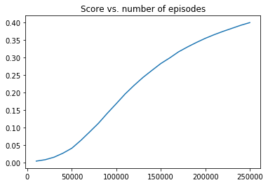

Code from [https://simoninithomas.github.io/Deep_reinforcement_learning_Course/](https://simoninithomas.github.io/Deep_reinforcement_learning_Course/)


```python
# Import packages
import numpy as np
import gym
import random
import matplotlib.pyplot as plt
%matplotlib inline

# Visualization function
%run Draw_FrozenLake.ipynb
```


```python
# Create environment
env = gym.make("FrozenLake8x8-v0")
env.render()
```

    
    SFFFFFFF
    FFFFFFFF
    FFFHFFFF
    FFFFFHFF
    FFFHFFFF
    FHHFFFHF
    FHFFHFHF
    FFFHFFFG
    

### Q-table


```python
action_size = env.action_space.n
print("Action size: ", action_size)

state_size = env.observation_space.n
print("State size: ", state_size)
```

    Action size:  4
    State size:  64
    

### Hyperparameters

1. Differences from FrozenLake-v0 which is 4x4:
  - Changes in minimum $\epsilon$ and its decay rate because we have a larger environment to explore (8x8) which is 4 times larger
  - More episodes to train our Q-table on (and as a result we need less decay on $\epsilon$ mentioned above)
  - Higher max_steps because our state_size is 4 times larger
    - The chance for a random action sequence to reach the end of the frozen lake in a 4x4 grid in 99 steps is much higher than the chance for an 8x8 grid. To compensate, we give each episode more steps.
    
The probability that a random action sequence reaches the end is at WORST 1/(4^6) or 1/4096 for a 4x4 grid because it needs to take 3 steps right and 3 steps down. I say at worst because there are combinations of 3 right, 3 down steps that also reach the end, but in a randomly generated frozen lake, we cannot be certain of the exact probability.

Compare this to an 8x8 frozen lake. We would need to take 7 steps right and 7 steps down at worst, which comes out to 1/(4^14) or 1/268435456. This is 4^8 times or 65,536 times more unlikely.

We keep the number of max_steps close to (action_size * state_size * 2) approximately, and crank the number of episodes up. Of course, if we take a look at our epsilon decay function, we see that it reaches min_epsilon rather quickly, so we decrease epsilon decay_rate and min_epsilon.


```python
qtable_history = []
score_history = []
qtable = np.zeros((state_size, action_size))

total_episodes = 250000       # Total episodes
learning_rate = 0.8           # Learning rate
max_steps = 400               # Max steps per episode
gamma = 0.9                  # Discounting rate

# Exploration parameters
epsilon = 1.0                 # Exploration rate
max_epsilon = 1.0             # Exploration probability at start
min_epsilon = 0.001            # Minimum exploration probability 
decay_rate = 0.00005             # Exponential decay rate for exploration prob
```


```python
# List of rewards
rewards = []

# 2 For life or until learning is stopped
for episode in range(total_episodes):
    # Reset the environment
    state = env.reset()
    step = 0
    done = False
    total_rewards = 0
    
    for step in range(max_steps):
        # 3. Choose an action a in the current world state (s)
        ## First we randomize a number
        exp_exp_tradeoff = random.uniform(0, 1)
        
        ## If this number > greater than epsilon --> exploitation (taking the biggest Q value for this state)
        if exp_exp_tradeoff > epsilon:
            action = np.argmax(qtable[state,:])

        # Else doing a random choice --> exploration
        else:
            action = env.action_space.sample()

        # Take the action (a) and observe the outcome state(s') and reward (r)
        new_state, reward, done, info = env.step(action)

        # Update Q(s,a):= Q(s,a) + lr [R(s,a) + gamma * max Q(s',a') - Q(s,a)]
        # qtable[new_state,:] : all the actions we can take from new state
        qtable[state, action] = qtable[state, action] + learning_rate * (reward + gamma * np.max(qtable[new_state, :]) - qtable[state, action])
        
        total_rewards += reward
        
        # Our new state is state
        state = new_state
        
        # If done (if we're dead) : finish episode
        if done == True: 
            break
        
    # Reduce epsilon (because we need less and less exploration)
    epsilon = min_epsilon + (max_epsilon - min_epsilon)*np.exp(-decay_rate*episode) 
    rewards.append(total_rewards)
    
    episode_count = episode + 1
    if episode_count % 10000 == 0:
        qtable_history.append(qtable)
        score_history.append(sum(rewards)/episode_count)
        save_canvas(qtable, 800, 800, filename = "./output/FrozenLake_ep" + str(episode_count) + ".png")

print ("Score over time: " +  str(sum(rewards)/total_episodes))
print(qtable)
```

    Score over time: 0.399036
    [[3.04990173e-04 3.66468917e-03 2.91640625e-04 3.06738972e-04]
     [8.12944415e-04 1.28704482e-02 3.62970233e-04 3.43069361e-04]
     [6.63808684e-04 5.66621774e-04 2.12327589e-02 5.93510983e-04]
     [3.41741910e-04 2.96820542e-04 3.27044472e-04 3.04134538e-02]
     [5.71102462e-04 5.65012072e-04 5.88121886e-02 5.75779952e-04]
     [2.10435793e-03 1.29556209e-03 4.28251102e-02 1.15263826e-03]
     [1.42663804e-03 2.87830739e-02 1.49533784e-03 1.45791054e-03]
     [1.13426435e-03 1.93791629e-02 1.78604589e-03 1.84206129e-03]
     [1.08502846e-04 2.76724565e-04 3.28626958e-04 7.33557266e-03]
     [3.31607590e-04 1.23364142e-04 7.41970238e-04 9.19624400e-03]
     [1.66004811e-04 1.83406936e-04 1.60421224e-04 2.31862445e-02]
     [2.25370034e-07 1.46208101e-04 2.87809984e-04 2.25049867e-02]
     [9.03344061e-04 4.96618281e-04 1.13750772e-03 2.28387181e-02]
     [1.08485965e-03 1.22650118e-03 3.29456479e-02 1.09807063e-03]
     [1.50844136e-03 1.20588961e-03 7.81990546e-02 1.84629870e-03]
     [2.10435606e-03 2.39722654e-02 2.19260780e-03 2.04546034e-03]
     [7.82499003e-05 7.74938189e-05 1.41941083e-03 6.84656139e-05]
     [9.34607223e-04 6.97681216e-05 1.01462811e-04 1.12173501e-04]
     [1.82205781e-02 5.28718853e-05 6.03444494e-06 3.42444174e-06]
     [0.00000000e+00 0.00000000e+00 0.00000000e+00 0.00000000e+00]
     [1.89036002e-05 1.19069542e-04 1.02586209e-02 2.74234737e-04]
     [2.90250177e-04 4.42974440e-05 1.02546028e-04 2.46165327e-02]
     [2.17614053e-03 4.32943890e-02 2.32113838e-03 1.90240840e-03]
     [1.12704056e-01 2.76130927e-03 2.76396539e-03 2.90179092e-03]
     [6.74580484e-05 6.51009822e-05 1.33239821e-04 6.34701042e-05]
     [5.56694457e-05 3.88160824e-05 7.13462456e-05 7.22576379e-04]
     [1.98974849e-04 7.14718503e-06 2.95739439e-05 9.79137570e-04]
     [4.89614655e-08 5.42833620e-08 7.56178474e-09 1.51907241e-03]
     [2.20673074e-03 6.03167320e-06 1.57741598e-05 5.22423135e-06]
     [0.00000000e+00 0.00000000e+00 0.00000000e+00 0.00000000e+00]
     [1.85503719e-03 1.48172749e-03 5.79354668e-02 8.15463583e-04]
     [4.93934498e-03 5.40057313e-02 4.93434652e-03 4.90596267e-03]
     [6.22889218e-06 6.40969219e-06 3.49653515e-06 3.53478974e-04]
     [9.59124856e-07 1.32637853e-06 9.86143124e-08 2.67235502e-04]
     [6.86461002e-05 6.77304539e-13 9.13027004e-13 1.53656251e-08]
     [0.00000000e+00 0.00000000e+00 0.00000000e+00 0.00000000e+00]
     [1.46422889e-05 6.74440556e-06 1.64303403e-03 2.69120895e-05]
     [5.29546816e-06 9.22069964e-03 1.35711410e-05 2.94993878e-05]
     [1.26255803e-03 3.35535942e-04 8.40768695e-04 1.35141535e-01]
     [2.72171310e-02 1.18858505e-02 4.10934254e-01 2.73956940e-02]
     [5.75756124e-04 8.32104176e-08 3.82454179e-05 2.48917031e-07]
     [0.00000000e+00 0.00000000e+00 0.00000000e+00 0.00000000e+00]
     [0.00000000e+00 0.00000000e+00 0.00000000e+00 0.00000000e+00]
     [6.77080809e-15 3.85642346e-11 6.40755549e-06 1.02003104e-11]
     [3.30332636e-06 1.32037397e-05 7.40884547e-07 1.65705466e-02]
     [4.82166939e-03 5.96682004e-06 1.40245500e-05 1.91677621e-06]
     [0.00000000e+00 0.00000000e+00 0.00000000e+00 0.00000000e+00]
     [1.01130275e-02 2.85639800e-02 6.20124692e-01 9.44484037e-03]
     [2.86998181e-04 1.28662960e-07 1.47898208e-08 6.57658571e-08]
     [0.00000000e+00 0.00000000e+00 0.00000000e+00 0.00000000e+00]
     [1.45590255e-10 7.64661302e-08 7.78954292e-11 2.38170506e-12]
     [3.22520831e-10 3.97225723e-10 8.82202328e-14 2.97333644e-06]
     [0.00000000e+00 0.00000000e+00 0.00000000e+00 0.00000000e+00]
     [3.29896368e-07 3.73933464e-08 1.14945576e-01 3.73957016e-09]
     [0.00000000e+00 0.00000000e+00 0.00000000e+00 0.00000000e+00]
     [1.92174488e-01 3.96927007e-02 9.46978349e-01 6.38379362e-02]
     [4.40863752e-04 1.07564411e-07 4.98985036e-05 1.14445861e-07]
     [3.57586175e-09 4.84848149e-04 9.22223734e-09 1.43817314e-08]
     [2.24396462e-04 1.44025820e-05 5.86374111e-09 3.24148331e-09]
     [0.00000000e+00 0.00000000e+00 0.00000000e+00 0.00000000e+00]
     [8.73854930e-08 5.96160027e-08 1.36159995e-07 7.86907329e-03]
     [1.85570157e-02 5.69081605e-03 4.58144286e-01 2.60365489e-03]
     [1.66241150e-02 8.91229367e-01 3.07837756e-02 3.48021718e-02]
     [0.00000000e+00 0.00000000e+00 0.00000000e+00 0.00000000e+00]]
    


```python
env.reset()
total_test_episodes = 1000
rewards = []

for episode in range(total_test_episodes):
    state = env.reset()
    step = 0
    done = False
    total_rewards = 0
    #print("****************************************************")
    #print("EPISODE ", episode)

    for step in range(max_steps):
        # UNCOMMENT IT IF YOU WANT TO SEE OUR AGENT PLAYING
        # env.render()
        # Take the action (index) that have the maximum expected future reward given that state
        action = np.argmax(qtable[state,:])
        
        new_state, reward, done, info = env.step(action)
        
        total_rewards += reward
        
        if done:
            rewards.append(total_rewards)
            print ("Score", total_rewards)
            print("Steps: ", step)
            break
        state = new_state
env.close()
#print ("Score over time: " +  str(sum(rewards)/total_test_episodes))
```


```python
# Plotting score over time
plt.plot(list(range(0, 250000+1, 10000))[1:], score_history)
plt.title("Score vs. number of episodes")
```


    Text(0.5,1,'Score vs. number of episodes')





```python
# Creating a gif with images we saved while training
import os
import imageio
os.chdir('./output/')
filenames = os.listdir()
images = []
for filename in filenames:
    images.append(imageio.imread(filename))
imageio.mimsave('FrozenLake.gif', images, duration = 1, loop = 1)
    
os.chdir('..')
```
