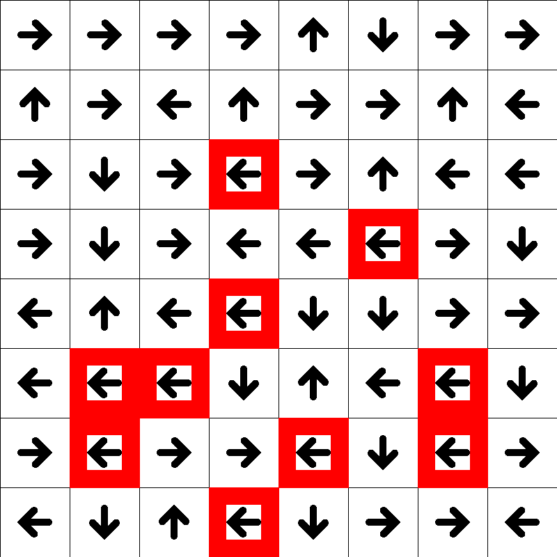

# Table of contents
1. [Introduction](#introduction)
2. [Q-learning and training](#main)
3. [Visualizing training](#visualize)

## Introduction 

Basic Q-learning trained on the FrozenLake8x8 environment provided by [OpenAI's gym toolkit](https://gym.openai.com/envs/FrozenLake8x8-v0/). Includes visualization of our agent training throughout episodes and hyperparameter choices.

## Q-learning and training 



## Visualizing training 

Important things to notice are that our Q-table's values are training towards moving from the start (top left) to the end (bottom right) while avoiding holes in the ice (red squares). When it is around holes, our Q-table tells our agent to move away from the ice.

This particular gif was created from hyperparameters of 250,000 episodes and 500 max steps per episode. Our agent gets better over time, but plateaus due to the ice being slippery (this means that some actions are overridden by a random action since we slipped).

Visualization/image functions can be found [here.]({{ site.baseurl }}/projects/FrozenLake/Draw_FrozenLake/)

Images generated through training can be found [here.]({{ site.baseurl }}/projects/FrozenLake/output/)