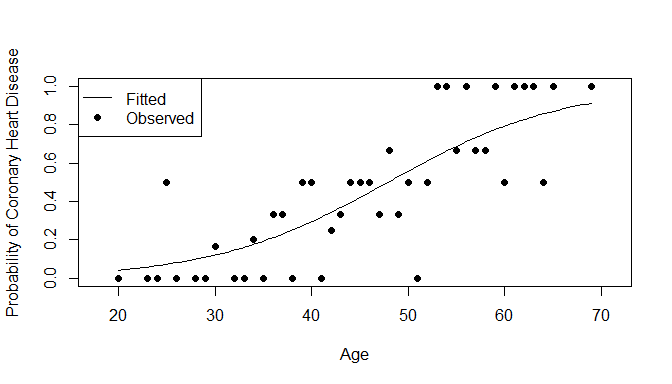
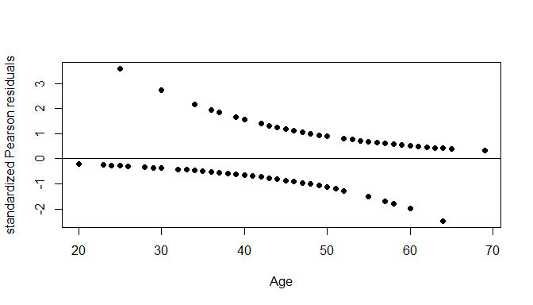

Introduction
============

Coronary heart disease is a disease in which plaque builds up inside the coronary arteries which supply oxygen-rich blood to the heart. As plaque continues to build up, the lack of blood flow to the heart can lead to heart attacks and heart failure. While there is no cure for coronary heart disease, there are treatments to help reduce and limit the build up of plaque in the coronary arteries. The goal of this report is to find if age is a significant factor in determining whether someone has coronary heart disease or not.

Material and Methods
====================

The data is taken from: <https://www.umass.edu/statdata/statdata/stat-logistic.html>

A description from the website follows: The goal of this study is explore the relationship between age and the presence or absence of CHD in this study population.

Attribute Information:
The data consists of 100 observations of two variables: Age and Coronary Heart Disease (CHD) which are my explanatory and response variables respectively. To analyze the data we use simple logistic regression which is appropriate because Age is a continuous explanatory variable (although it is measured on a discrete scale) and Coronary Heart Disease is a binary response.

Results
=======

To start the analysis, we fit a simple logistic regression model to our data:

$$
  logit(\\pi\_i) = log(\\frac{\\pi\_i}{1-\\pi\_i}) = -5.3094534 + 0.1109211x\_i
$$

A plot of the model and observed data is given below: 

The Wald test for testing *H*<sub>0</sub> : *β*<sub>1</sub> = 0 vs. *H*<sub>*a*</sub> : *β*<sub>1</sub> ≠ 0 is given below:

    ##               Estimate Std. Error   z value     Pr(>|z|)
    ## (Intercept) -5.3094534 1.13365365 -4.683488 2.820338e-06
    ## AGE          0.1109211 0.02405982  4.610224 4.022356e-06

We see that $z\_W = \\frac{\\hat{\\beta\_1} - 0}{SE(\\beta\_1)} = \\frac{0.11092}{0.02406} = 4.610$ with corresponding p-value = 4.02 × 10<sup>−6</sup>. Since our p-value &lt; *α* = 0.05, we reject *H*<sub>0</sub> and conclude that the slope (*β*<sub>1</sub>) is nonzero.

We find our estimated odds ratio $e^{\\hat{\\beta\_1}} = e^{0.11092} = 1.117306$. The odds ratio can be interpreted as for every increase in one year of a person's age, we expect to see a 11.7306% increase in the odds of them having coronary heart disease. Going further, we can obtain the confidence interval for the odds ratio:
So, we are 95% confident that the true odds ratio lies between \[1.065839, 1.171257\]. We are 95% confident that there is a 6.5839% to 17.1257% increase in the odds of someone having coronary heart disease for every additional year increase to their age.

The maximum slope of our (fitted) probability curve above is 0.0277303 which occurs when Age = 47.8669194. That is, the probability of having coronary heart disease increases at most by 2.7730286% which occurs at an age of 47.8669194 years.

We now perform a goodness of fit test for our logistic model using two methods: likelihood ratio and the Hosmer and Lemeshow test.

For the likelihood ratio test, we compare our full model *l**o**g**i**t*(*π*<sub>*i*</sub>)=*β*<sub>0</sub> + *β*<sub>1</sub>*x*<sub>*i*</sub> with the reduced model *l**o**g**i**t*(*π*<sub>*i*</sub>)=*β*<sub>0</sub>. The resulting deviance −2*l**o**g**Λ* = 107.3530927 is distributed *χ*<sub>1</sub>. The resulting p-value is calculated to be 0 (because it is less than machine precision *ϵ* = 10<sup>−16</sup>). Thus, we conclude that our full model is a better fit than the reduced model.

For the Hosmer and Lemeshow test, we find

    ## 
    ##  Hosmer and Lemeshow goodness of fit (GOF) test
    ## 
    ## data:  CHD, fitted(model)
    ## X-squared = 2.2243, df = 8, p-value = 0.9734

Since our p-value is large, we conclude that the fit of our model is pretty good.

Next, we perform residual diagnostics for our model using studentized Pearson residuals $\\hat{r}\_{p, i} = \\frac{r\_i}{\\sqrt{1-h\_i}}$ which are close to standard normal. Below is a plot of the studentized Pearson residuals against Age: 

We notice that there are some residuals not in the range of \[-2, 2\] and they correspond to these observations:

    ##    AGE CHD
    ## 5   25   1
    ## 16  30   1
    ## 23  34   1
    ## 97  64   0

These are the outliers in our data, but before we consider removing them, we check to see if they are influential observations. Recall that an observation is influential if $h\_i &gt; \\frac{2p}{n}$. The *h*<sub>*i*</sub> values for these observations are given below

    ##          5         16         23         97 
    ## 0.02128102 0.02188050 0.02042241 0.02963014

Notice that none of these values are greater than $\\frac{2p}{n} = \\frac{4}{100} = 0.04$. Thus, none of these outliers are influential observations and we do not remove them.

Conclusion and Discussion
=========================

In summary, our model is
$$
  logit(\\pi\_i) = log(\\frac{\\pi\_i}{1-\\pi\_i}) = -5.3094534 + 0.1109211x\_i
$$
 and we have found that age is significant in determining whether someone has coronary heart disease or not.

We are 95% confident that there is a 6.5839% to 17.1257% increase in the odds of someone having coronary heart disease for every additional year increase to their age. Also, the probability of having coronary heart disease increases at most by 2.7730286% which occurs at an age of 47.8669194 years. In addition, while there are outliers in our data, they are not influential points indicating that our model still fits the data well.

Of course, this project does not give a definitive answer of whether age is the only factor in determining if someone has coronary heart disease, but it does show that it is significant. There are lots of other variables that could be considered when determining whether someone has coronary heart disease or not including diet, exercise, genetics, etc., but our analysis focuses only on age.

Code Appendix
=============

``` r
setwd("C:/Users/Christopher/Desktop/STA 138/Project 2")
chdage <- read.table("C:/Users/Christopher/Desktop/STA 138/Project 2/chdage.dat",
                     header=TRUE, quote="\"")
# Remove ID column
chdage$ID <- NULL
attach(chdage)

model <- glm(CHD~AGE, data = chdage, family = binomial(link = logit))
b0=coef(model)[1]       # extract the estimate of intercept #
b1=coef(model)[2]       # extract the estimate of slope #

# define the estimated probability function #
estprob=function(x){    
  z=exp(b0+b1*x)/(1+exp(b0+b1*x))
  return(z)
}
chdage.table <- table(chdage)
# calculate the sample proportion at observed Age #
prop_raw=chdage.table[, 2]/(chdage.table[, 2]+chdage.table[, 1])    

# plot of observed (black), fitted (solid line)
curve(estprob,from=20,to=69,xlim=c(18,71),ylim=c(0,1),
      ylab="Probability of Coronary Heart Disease",xlab="Age")       
points(unique(chdage$AGE), prop_raw, pch=19)
legend('topleft', legend = c("Fitted", "Observed"), lty = c(1, NA), pch = c(NA, 19))

summary(model)$coefficients

# Odds ratio
odds <- exp(b1)

# CI for odds ratio
odds.CI <- c(exp(0.11092-1.96*0.02406), exp(0.11092+1.96*0.02406))

# Maximum of slope and where it occurs
b1/4
-b0/b1

library(ResourceSelection)                                      
hoslem.test(CHD, fitted(model))

# standardized Pearson residuals #
pear.stdresid=resid(model,type="pearson")/sqrt(1-lm.influence(model)$hat)                 
# plot of standardized Pearson residuals against Age #
plot(chdage$AGE,pear.stdresid,pch=19,xlab="Age",ylab="standardized Pearson residuals")  
abline(h=0)

chdage[which(abs(pear.stdresid) > 2), ]
h <- lm.influence(model)$hat
h[which(abs(pear.stdresid) > 2)]
```
