Introduction
============

Our data file contains two columns, one containing the daily average receipts per theater for the movie and the other dates from January 3, 2003 to April 18, 2003. In total, we have 106 observations, one for each day. Our data is a time series because it is a set of observations recorded at specific times. In our case, we have a descrete-time time series because we record one observation per day (daily). Time series modeling can allow us to predict/forecast long-term trends after removing the presence of seasonal components.

The Data
========

Let's take a look at our plotted data:  We notice that there is some kind of seasonality in our data because we have a very sharp increase and decrease in average receipts per theater approximately every 7 days (or a week). Oscillations with fixed periods clue us into the fact that there is seasonality in our data. After doing a bit of research online, we find that was released on December 27, 2002 and our data started to be collected about a week after launch (January 3, 2003). Hence, we expect to see a gradual decrease in average receipts per theater the longer the movie has been out. This is confirmed when we look at our time series plot and see that the general trend is decreasing as time increases. Since there is both trend and seasonality present in our data, we will model our data with a smooth part for trend, a seasonal part for seasonality, and the rough part will be determined later. Our model will be as follows:
*Y*<sub>*t*</sub> = *m*<sub>*t*</sub> + *s*<sub>*t*</sub> + *X*<sub>*t*</sub>  *t* = 1, ..., 106
 where *Y*<sub>*t*</sub> is our observed data (average receipts per theater), *m*<sub>*t*</sub> is our trend, *s*<sub>*t*</sub> is our seasonality, and *X*<sub>*t*</sub> is our rough part.

The Data and Transformations
============================

Here is our plotted data again: 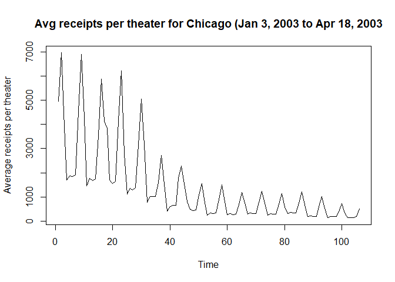 where t = 1 corresponds to January 3, 2003 and t = 106 corresponds to April 18, 2003.

We plot a few common Box-Cox transformations for *λ* = -2, -1, 0, 1, 2 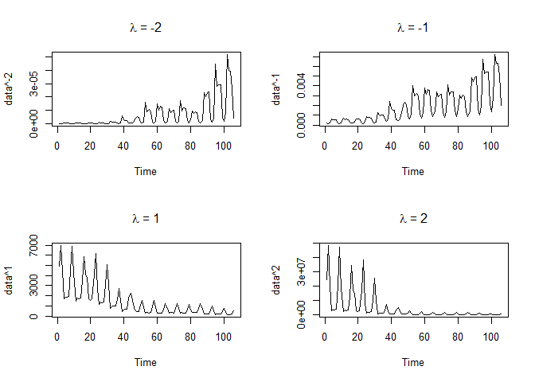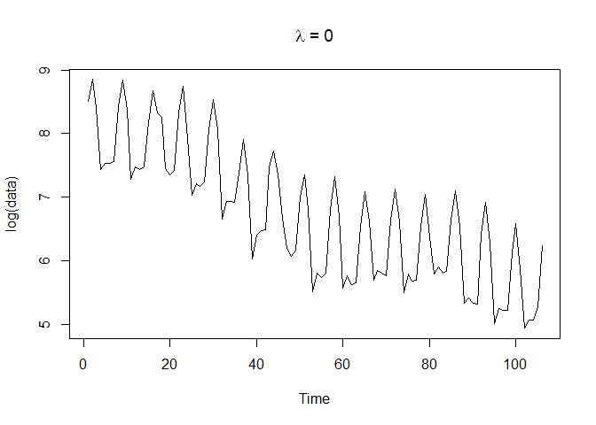 We see that for *λ* = 0, i.e. the (natural) log transform, the fluctuations in our data seem to be almost the same over time unlike the other transformations above. Thus, we will choose to work with our log-transformed data from here on out. Also, we can verify that while this is not the absolute best transformation, it is very reasonable. We use the function from the library and find that *λ* = -0.1010101 is the absolute best transformation. The plot of the log-likelihood vs *λ* given below also includes a 95% confidence interval for *λ* and clearly *λ* = 0 is in that interval which makes it a very reasonable transformation. 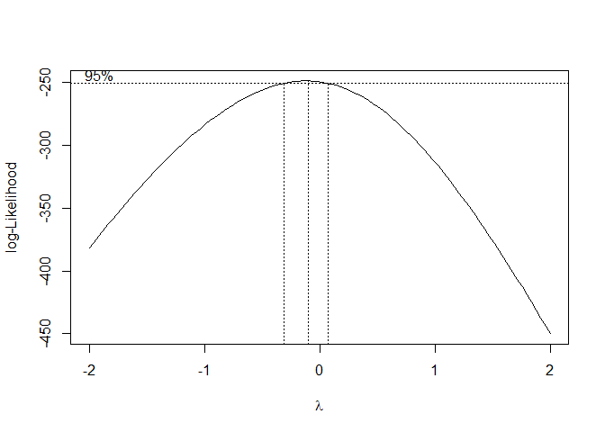

Trend and Seasonality
=====================

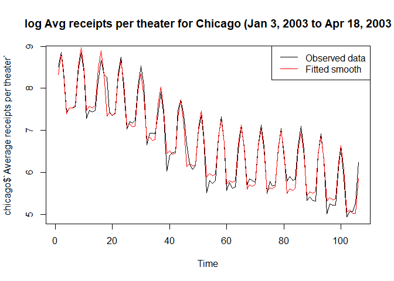 After tinkering around with a few values, we find that a degree 4 polynomial model fits the trend very well, so we choose to go with a degree 4 polynomial model. We also find that a weekly (7 day) seasonality period matches up very well with our oscillations in our data. Our fitted model turns out to be
*Y*<sub>*t*</sub><sup>′</sup> = *β*<sub>0</sub> + *β*<sub>1</sub>*t* + *β*<sub>2</sub>*t*<sup>2</sup> + *β*<sub>3</sub>*t*<sup>3</sup> + *β*<sub>4</sub>*t*<sup>4</sup> + *β*<sub>5</sub>*I*<sub>*t*, 1</sub> + *β*<sub>6</sub>*I*<sub>*t*, 2</sub> + *β*<sub>7</sub>*I*<sub>*t*, 3</sub> + *β*<sub>8</sub>*I*<sub>*t*, 4</sub> + *β*<sub>9</sub>*I*<sub>*t*, 5</sub> + *β*<sub>10</sub>*I*<sub>*t*, 6</sub> + *X*<sub>*t*</sub>
 where *β*<sub>0</sub> = 7.776851, *β*<sub>1</sub> = 5.9398264, *β*<sub>2</sub> = −40.4796609, *β*<sub>3</sub> = 60.9748347, *β*<sub>4</sub> = −28.8558188, *β*<sub>5</sub> = 0.501546, *β*<sub>6</sub> = 0.9461506, *β*<sub>7</sub> = 0.415075, *β*<sub>8</sub> = −0.5528182, *β*<sub>9</sub> = −0.4385818, *β*<sub>10</sub> = −0.4686461.

Plots of the trend, seasonal component, rough
=============================================

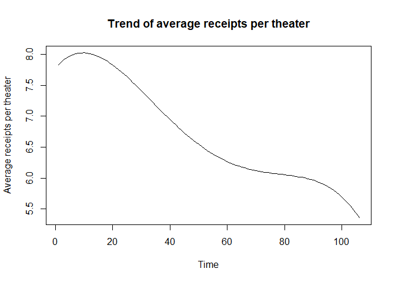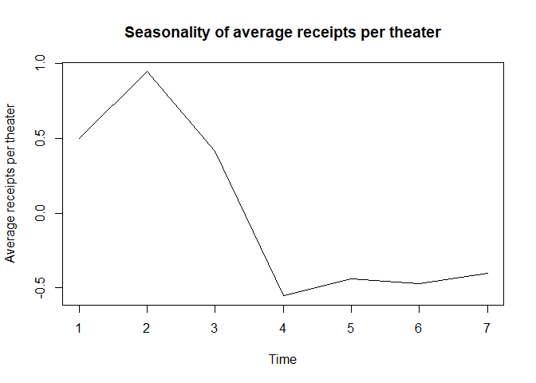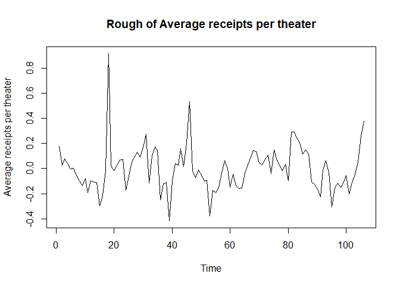

Diagnostics for the Rough
=========================

 We see that the rough looks centered around 0 and has equal variance for the most part except for the one outlier at t = 18.

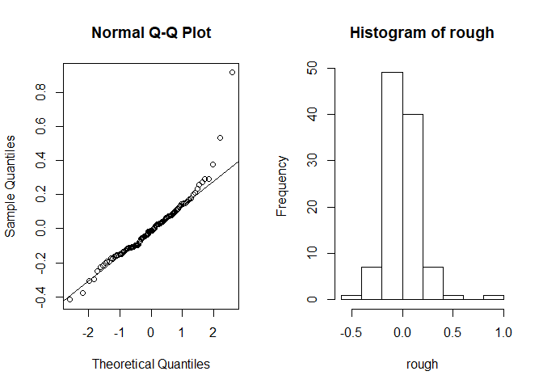 The assumption of normality is satisfied because the all of our points except the the last one lie on the qqline and the histogram looks normal except for the one outlier at the end.

    ## 
    ##  Box-Ljung test
    ## 
    ## data:  chicago$`Average receipts per theater`
    ## X-squared = 391.72, df = 10, p-value < 2.2e-16

Since our p-value ≈ 0 &lt; 0.05, we reject the assumption of independence for our data. It is safe to say at this point that we have a stationary sequence.

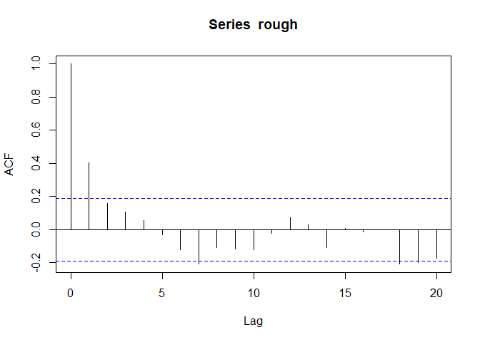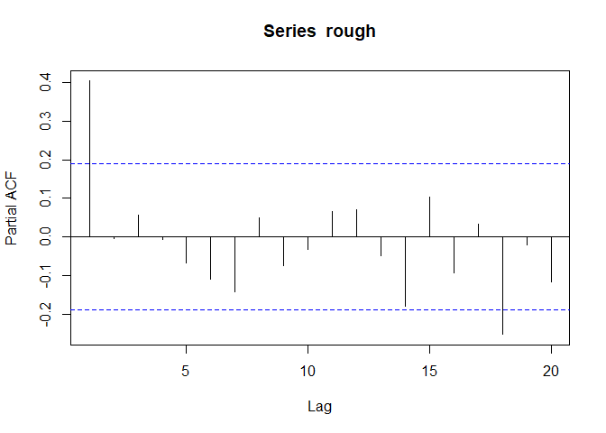 Our ACF and PACF plots look consistent with what we would expect from an AR(1) model which we will expand on in the next section.

Obtaining an appropriate AR(p) model
====================================

From the previous section, the ACF plot gradually tails off to 0, kind of oscillating around it for a while. On the other hand, the PACF plot cuts off after lag 1 (for the most part) which is consistent with an AR(1) model. Below is a table for the AICC values for different AR(p) models:
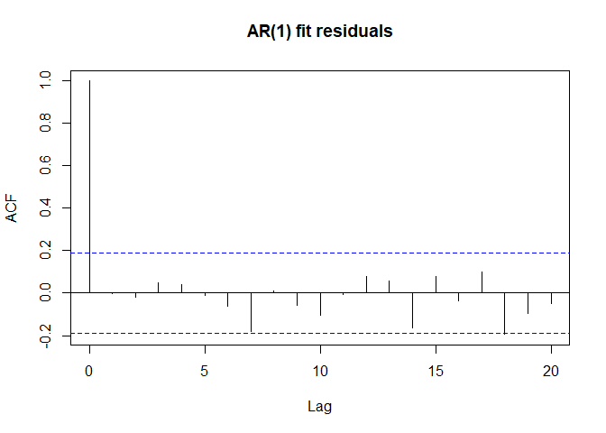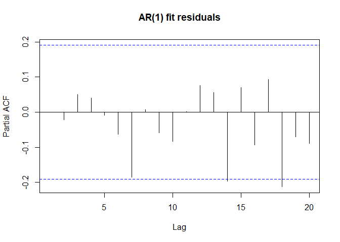 Looking at the ACF and PACF plots of our AR(1) model residuals, we can safely say that the residuals are white noise since all of them lie within the 95% confidence interval (for the most part). We can also perform a Box-Ljung test to show that they are indeed independent:

    ## 
    ##  Box-Ljung test
    ## 
    ## data:  fit$residuals
    ## X-squared = 6.3948, df = 10, p-value = 0.7811

Predicting the last 7 days
==========================

With the first 99 observations
------------------------------

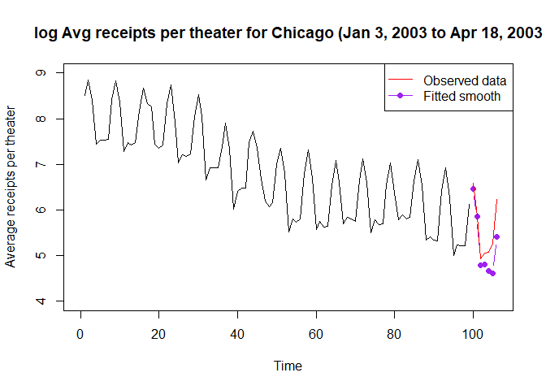

    ## Time Series:
    ## Start = 100 
    ## End = 106 
    ## Frequency = 1 
    ##          [,1]
    ## [1,] 6.465702
    ## [2,] 5.849715
    ## [3,] 4.786403
    ## [4,] 4.804757
    ## [5,] 4.671551
    ## [6,] 4.619667
    ## [7,] 5.410379

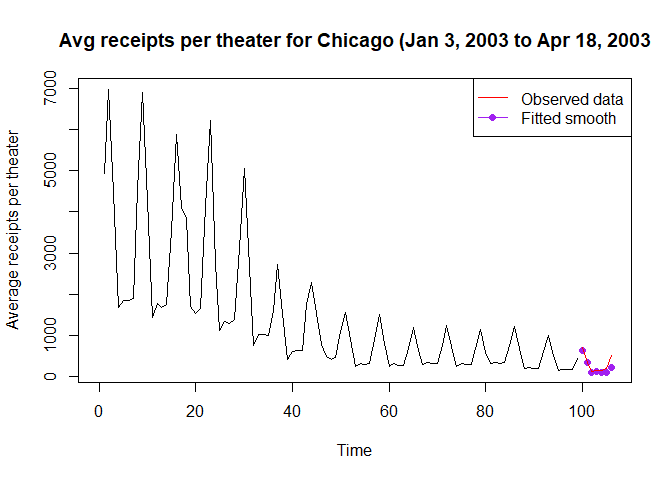

With the best model using ALL observations
------------------------------------------

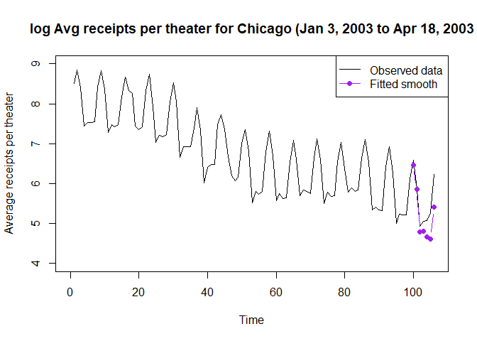

    ## Time Series:
    ## Start = 107 
    ## End = 113 
    ## Frequency = 1 
    ##          [,1]
    ## [1,] 6.384161
    ## [2,] 5.676363
    ## [3,] 4.577408
    ## [4,] 4.575467
    ## [5,] 4.430917
    ## [6,] 4.378264
    ## [7,] 5.157213

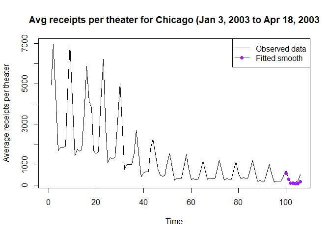

Final model
===========

Our final model turns out to be
*Y*<sub>*t*</sub><sup>′</sup> = *β*<sub>0</sub> + *β*<sub>1</sub>*t* + *β*<sub>2</sub>*t*<sup>2</sup> + *β*<sub>3</sub>*t*<sup>3</sup> + *β*<sub>4</sub>*t*<sup>4</sup> + *β*<sub>5</sub>*I*<sub>*t*, 1</sub> + *β*<sub>6</sub>*I*<sub>*t*, 2</sub> + *β*<sub>7</sub>*I*<sub>*t*, 3</sub> + *β*<sub>8</sub>*I*<sub>*t*, 4</sub> + *β*<sub>9</sub>*I*<sub>*t*, 5</sub> + *β*<sub>10</sub>*I*<sub>*t*, 6</sub> + *β*<sub>11</sub> + *β*<sub>12</sub>*X*<sub>*t* − 1</sub> + *ϵ*<sub>*t*</sub>
 where *β*<sub>0</sub> = 7.776851, *β*<sub>1</sub> = 5.9398264, *β*<sub>2</sub> = −40.4796609, *β*<sub>3</sub> = 60.9748347, *β*<sub>4</sub> = −28.8558188, *β*<sub>5</sub> = 0.501546, *β*<sub>6</sub> = 0.9461506, *β*<sub>7</sub> = 0.415075, *β*<sub>8</sub> = −0.5528182, *β*<sub>9</sub> = −0.4385818, *β*<sub>10</sub> = −0.4686461, *β*<sub>11</sub> = *μ*(1 − *ϕ*), *β*<sub>12</sub> = *ϕ*.

A simpler description would be that we model our trend with a degree 4 polynomial, our seasonality (which has period 7) with 6 indicator variables, and our rough by an AR(1) model.

Also, our model is not perfect. There are ways to improve, e.g. using loess to model the trend instead of a polynomial.

Doing some background research, we found that January 3, 2003 was actually a Friday which may explain why average receipts per theater increases every week (7 day period) after that and peaks on a Saturday before slowing down Sunday and dropping off on the weekdays. We also expect the trend to be decreasing because movies usually have an initial boom upon release and gradually earns less as more and more people have gone to see it already. So, by the time it has been over 105 days (15 weeks), we expect the movie to be earning very little.

Code Appendix
=============

``` r
setwd("C:/Users/Christopher/Desktop/STA 137/Midterm")
source("trndseas.R")
source("C:/Users/Christopher/Desktop/STA 137/Homework 4/aicc.R")
library(MASS)

chicago <- read.delim("C:/Users/Christopher/Desktop/STA 137/Midterm/chicago.txt", header=FALSE)
names(chicago) <- c("Average receipts per theater", "Date")
chicago1 <- chicago

# The Data
plot.ts(chicago$`Average receipts per theater`, ylab = "Average receipts per theater",
        main = "Avg receipts per theater for Chicago (Jan 3, 2003 to Apr 18, 2003")

# The Data and Transformations
plot.ts(chicago$`Average receipts per theater`, ylab = "Average receipts per theater",
        main = "Avg receipts per theater for Chicago (Jan 3, 2003 to Apr 18, 2003")
transformPlots <- function(data){
  par(mfrow = c(2, 2))
  plot.ts(data^-2, main = expression(""*lambda*" = -2"))
  plot.ts(data^-1, main = expression(""*lambda*" = -1"))
  plot.ts(data^1, main = expression(""*lambda*" = 1"))
  plot.ts(data^2, main = expression(""*lambda*" = 2"))
  par(mfrow = c(1, 1))
  plot.ts(log(data), main = expression(""*lambda*" = 0"))
}
transformPlots(chicago$`Average receipts per theater`)
boxcox(chicago$`Average receipts per theater`~1)

# Trend and Seasonality
chicago$`Average receipts per theater` = log(chicago$`Average receipts per theater`)
mod <- trndseas(chicago$`Average receipts per theater`, degtrnd = 4, seas = 7)
plot.ts(chicago$`Average receipts per theater`,
        main = "log Avg receipts per theater for Chicago (Jan 3, 2003 to Apr 18, 2003")
points(mod$fit, type = 'l', col = 'red')
legend("topright", legend = c("Observed data", "Fitted smooth"), col = c("black", "red"), lty = 1)

# Plots of the trend, seasonal component, rough
plot.ts(mod$trend, main = "Trend of average receipts per theater", ylab = "Average receipts per theater")
plot.ts(mod$season, main = "Seasonality of average receipts per theater", ylab = "Average receipts per theater")
rough <- chicago$`Average receipts per theater` - mod$fit
plot.ts(rough, main = "Rough of Average receipts per theater", ylab = "Average receipts per theater")

# Diagnostics for the Rough
plot.ts(rough, main = "Rough of Average receipts per theater", ylab = "Average receipts per theater")
par(mfrow = c(1, 2))
qqnorm(rough)
qqline(rough)
hist(rough)
par(mfrow = c(1, 1))
Box.test(chicago$`Average receipts per theater`, lag = 10, type = "Ljung-Box")
acf(rough)
pacf(rough)

# Obtaining an appropriate AR(p) model
AR.Fitter <- function(data, p = 5){
  Result <- sapply(0:p, function(i){
    fit <- arima(data, order = c(i, 0, 0))
    return(list(fit, aicc(fit)))
  })
  return(Result)
}
models <- AR.Fitter(rough)
fit <- arima(rough, order = c(1, 0, 0))
acf(fit$residuals, main = "AR(1) fit residuals")
pacf(fit$residuals, main = "AR(1) fit residuals")
Box.test(fit$residuals, lag = 10, type = "Ljung-Box")

## With the first 99 observations
n <- 99
h <- 7
mod0 <- trndseas(chicago$`Average receipts per theater`[1:n], degtrnd = 4, seas = 7)
m.fit <- mod0$trend
s.fit <- rep(mod0$season, length.out = n)
smooth.fit <- mod0$fit
deg <- 4
coef = mod0$coef[1:(deg+1)]
time = (n+(1:h))/n
predmat = matrix(rep(time,deg)^rep(1:deg,each=h),nrow=h,byrow=F)
predmat = cbind(rep(1,h),predmat)

rough0 <- chicago$`Average receipts per theater`[1:n] - mod0$fit
fit0 <- arima(rough0, order = c(1, 0, 0))

m.fc = predmat %*% coef
s.fc = rep(mod0$season,length.out=n+h)
s.fc = s.fc[-(1:n)]
fcast = predict(fit0,n.ahead=h)
x.fc = fcast$pred
y.fc = m.fc + s.fc + x.fc

plot.ts(chicago$`Average receipts per theater`[1:n],xlim=c(0,n+h), ylim = c(4, 9),
        ylab = "Average receipts per theater",
        main = "log Avg receipts per theater for Chicago (Jan 3, 2003 to Apr 18, 2003")
points(x=n+1:h, y=y.fc, col='purple',type='b',pch=19)
points(x=n+1:h, y=chicago$`Average receipts per theater`[100:106], col = "red", type = "l")
legend("topright", legend = c("Observed data", "Fitted smooth"),
       col = c("red", "purple"), lty = 1, pch = c(NA, 19))
y.fc
a1 <- exp(y.fc)
plot.ts(chicago1$`Average receipts per theater`[1:n],xlim=c(0,n+h),
        ylab = "Average receipts per theater",
        main = "Avg receipts per theater for Chicago (Jan 3, 2003 to Apr 18, 2003")
points(x=n+1:h, y=a1, col='purple',type='b',pch=19)
points(x=n+1:h, y=chicago1$`Average receipts per theater`[100:106], col = "red", type = "l")
legend("topright", legend = c("Observed data", "Fitted smooth"),
       col = c("red", "purple"), lty = 1, pch = c(NA, 19))

## With the best model using ALL observations
m.fit1 <- mod$trend
s.fit1 <- rep(mod$season, length.out = n)
smooth.fit1 <- mod$fit
deg <- 4
coef1 = mod$coef[1:(deg+1)]
time = (n+(1:h))/n
predmat1 = matrix(rep(time,deg)^rep(1:deg,each=h),nrow=h,byrow=F)
predmat1 = cbind(rep(1,h),predmat1)

m.fc1 = predmat1 %*% coef1
s.fc1 = rep(mod$season,length.out=n+h)
s.fc1 = s.fc1[-(1:n)]
fcast1 = predict(fit,n.ahead=h)
x.fc1 = fcast1$pred
y.fc1 = m.fc1 + s.fc1 + x.fc1

plot.ts(chicago$`Average receipts per theater`,xlim=c(0,n+h), ylim = c(4, 9),
        ylab = "Average receipts per theater",
        main = "log Avg receipts per theater for Chicago (Jan 3, 2003 to Apr 18, 2003")
points(x=n+1:h, y=y.fc, col='purple',type='b',pch=19)
legend("topright", legend = c("Observed data", "Fitted smooth"),
       col = c("black", "purple"), lty = 1, pch = c(NA, 19))
y.fc1
a2 <- exp(y.fc1)
plot.ts(chicago1$`Average receipts per theater`,xlim=c(0,n+h),
        ylab = "Average receipts per theater",
        main = "Avg receipts per theater for Chicago (Jan 3, 2003 to Apr 18, 2003")
points(x=n+1:h, y=a2, col='purple',type='b',pch=19)
legend("topright", legend = c("Observed data", "Fitted smooth"),
       col = c("black", "purple"), lty = 1, pch = c(NA, 19))
```
