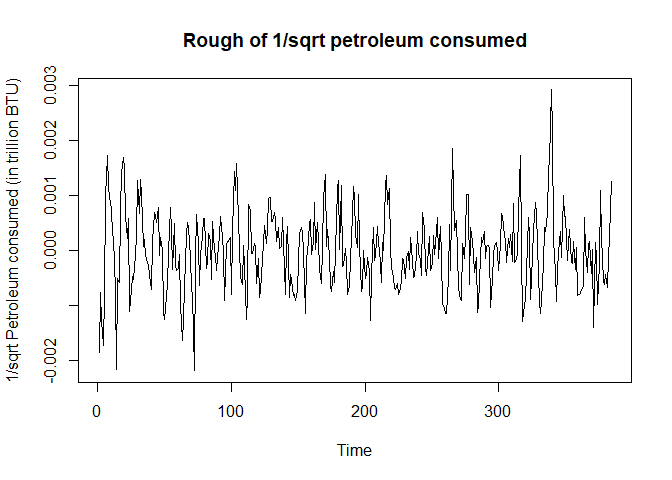

Introduction
============

Our data file contains two columns, one containing petroleum consumed (in trillion BTU) by the residential sector in the US (per month) and the other months from January 1984 to December 2015. In total, we have 384 observations, one for each month. Our data is a time series because it is a set of observations recorded at specific times. In our case, we have a descrete-time time series because we record one observation per month (monthly). Time series modeling can allow us to predict/forecast long-term trends after removing the presence of seasonal components.

The Data
========

Let's take a look at our plotted data:  We notice that there is some kind of seasonality in our data because we have a very sharp increase and decrease in petroleum consumption approximately every 12 months (or a year). Oscillations with fixed periods clue us into the fact that there is seasonality in our data. We expect to see a gradual increase in petroleum consumption as time goes on because population will increase and thus so will people using automobiles. This is confirmed when we look at our time series plot and see that the general trend is increasing as time increases. Since there is both trend and seasonality present in our data, we will model our data with a smooth part for trend, a seasonal part for seasonality, and the rough part will be determined later. Our model will be as follows:
*Y*<sub>*t*</sub> = *m*<sub>*t*</sub> + *s*<sub>*t*</sub> + *X*<sub>*t*</sub>  *t* = 1, ..., 384
 where *Y*<sub>*t*</sub> is our observed data (petroleum consumption (in trillion BTU)), *m*<sub>*t*</sub> is our trend, *s*<sub>*t*</sub> is our seasonality, and *X*<sub>*t*</sub> is our rough part.

The Data and Transformations
============================

Here is our plotted data again:  where t = 1 corresponds to January 1984 and t = 384 corresponds to December 2015.

We plot a few common Box-Cox transformations for *λ* = -2, -1, -0.5, 1, 2  We see that for *λ* = -0.5, i.e. the $\\frac{1}{\\sqrt{x}}$ transform, the fluctuations in our data seem to be almost the same over time unlike the other transformations above. Thus, we will choose to work with our $\\frac{1}{sqrt}$ transformed data from here on out. Also, we can verify that while this is not the absolute best transformation, it is very reasonable. We use the function from the library and find that *λ* = -0.653 is the absolute best transformation. The plot of the log-likelihood vs *λ* given below also includes a 95% confidence interval for *λ* and clearly *λ* = −0.5 is in that interval which makes it a very reasonable transformation.  We can also consider the $\\frac{1}{x}$ transform, but if we compare the log-likelihood values at *λ* = −0.5 and *λ* = −1, we find that:
$$
\\begin{tabular}{|c|c|c|}
  \\hline
  $\\lambda$ & -1 & -0.5\\\\
  \\hline
  \\text{log-likelihood} & -564.8943267 & -563.9076205\\\\
  \\hline
\\end{tabular}
$$
 Clearly, the $\\frac{1}{\\sqrt{x}}$ transform is better than the $\\frac{1}{x}$ transform, but barely.

Trend and Seasonality (of the transformed data)
===============================================

 After tinkering around with a few values, we find that a degree 3 polynomial model fits the trend very well, so we choose to go with a degree 3 polynomial model. We also find that a yearly (12 month) seasonality period matches up very well with our oscillations in our data. Our fitted model turns out to be
*Y*<sub>*t*</sub><sup>′</sup> = *β*<sub>0</sub> + *β*<sub>1</sub>*t* + *β*<sub>2</sub>*t*<sup>2</sup> + *β*<sub>3</sub>*t*<sup>3</sup> + *β*<sub>4</sub>*I*<sub>*t*, 1</sub> + *β*<sub>5</sub>*I*<sub>*t*, 2</sub> + *β*<sub>6</sub>*I*<sub>*t*, 3</sub> + *β*<sub>7</sub>*I*<sub>*t*, 4</sub> + *β*<sub>8</sub>*I*<sub>*t*, 5</sub> + *β*<sub>9</sub>*I*<sub>*t*, 6</sub> + *β*<sub>10</sub>*I*<sub>*t*, 7</sub> + *β*<sub>11</sub>*I*<sub>*t*, 8</sub> + *β*<sub>12</sub>*I*<sub>*t*, 9</sub> + *β*<sub>13</sub>*I*<sub>*t*, 10</sub> + *β*<sub>14</sub>*I*<sub>*t*, 11</sub> + *X*<sub>*t*</sub>
 where *β*<sub>0</sub> = 0.0280833, *β*<sub>1</sub> = −0.0053302, *β*<sub>2</sub> = −0.0059232, *β*<sub>3</sub> = 0.0077356, *β*<sub>4</sub> = −0.004547, *β*<sub>5</sub> = −0.0028595, *β*<sub>6</sub> = −0.0016832, *β*<sub>7</sub> = 0.0015151, *β*<sub>8</sub> = 0.0028122, *β*<sub>9</sub> = 0.0018471, *β*<sub>10</sub> = −1.0139541 × 10<sup>−5</sup>, *β*<sub>11</sub> = 1.2031183 × 10<sup>−4</sup>, *β*<sub>12</sub> = 0.002252, *β*<sub>13</sub> = 0.0028012, *β*<sub>14</sub> = 7.6622444 × 10<sup>−4</sup>.

Plots of the trend, seasonal component, rough (of the transformed data)
=======================================================================

 Note that trend is decreasing because we are plotting the transformed data, so a decreasing trend of $\\frac{1}{\\sqrt{x}}$ is equivalent to an increasing trend in the original data.

Diagnostics for the Rough
=========================

 We see that the rough looks centered around 0 and has equal variance for the most part.

 The assumption of normality is satisfied because the all of our points except the first and last few lie on the qqline and the histogram looks normal.

    ## 
    ##  Box-Ljung test
    ## 
    ## data:  rough
    ## X-squared = 238.18, df = 10, p-value < 2.2e-16

Since our p-value ≈ 0 &lt; 0.05, we reject the assumption of independence for our data. It is safe to say at this point that we have a stationary sequence.

 Our ACF and PACF plots look consistent with what we would expect from an ARMA model which we will expand on in the next section.

 Top left: Raw periodogram

Top right: Smoothed periodogram using 3 neighbors

Bottom left: Smoothed periodogram using 7 neighbors

Bottom right: Smoothed periodogram using 11 neighbors

These are periodograms for the rough part of our data (i.e. data-trend-seasonality). There is little difference in the periodograms using strictly detrended (i.e. data-trend) and only the rough part, so we will choose to use the rough part. We would use the smooted periodogram using 7 neighbors. We see that there is one outstanding peak in our periodogram which implies that there may be a hidden periodicity in our data at frequency $\\frac{1}{12}$ (or period 12 months).

Obtaining an appropriate ARIMA(p, d, q) model
=============================================

    ## Warning: package 'forecast' was built under R version 3.5.1

From the previous section, the ACF and PACF plots gradually oscillate and tail off to 0, which is consistent with an ARMA(p, q) model. We will use the function from the package to find the best ARIMA model using the AICC criterion. It turns out that an ARMA(2, 1) model is the best model with *ϕ*<sub>1</sub> = 0.1444391, *ϕ*<sub>2</sub> = 0.5582085, *θ* = −0.2688684.  Looking at the ACF and PACF plots of our ARMA(2, 1) model residuals, we can safely say that the residuals are white noise since most of them lie within the 95% confidence interval. We can also perform a Box-Ljung test to show that they are indeed independent:

    ## 
    ##  Box-Ljung test
    ## 
    ## data:  res
    ## X-squared = 7.44, df = 10, p-value = 0.6834

We plot the spectral density of our ARMA(2, 1) model and the smoothed periodogram below:  We see that there is one outstanding peak in our periodogram and spectral density graph which implies that there may be a hidden periodicity in our data at frequency $\\frac{1}{12}$ (or period 12 months).

Final model
===========

Our final model turns out to be
where *β*<sub>0</sub> = 0.0280833, *β*<sub>1</sub> = −0.0053302, *β*<sub>2</sub> = −0.0059232, *β*<sub>3</sub> = 0.0077356, *β*<sub>4</sub> = −0.004547, *β*<sub>5</sub> = −0.0028595, *β*<sub>6</sub> = −0.0016832, *β*<sub>7</sub> = 0.0015151, *β*<sub>8</sub> = 0.0028122, *β*<sub>9</sub> = 0.0018471, *β*<sub>10</sub> = −1.0139541 × 10<sup>−5</sup>, *β*<sub>11</sub> = 1.2031183 × 10<sup>−4</sup>, *β*<sub>12</sub> = 0.002252, *β*<sub>13</sub> = 0.0028012, *β*<sub>14</sub> = 7.6622444 × 10<sup>−4</sup>, *β*<sub>15</sub> = *μ*(1 − *ϕ*<sub>1</sub> − *ϕ*<sub>2</sub>), *β*<sub>16</sub> = *ϕ*<sub>1</sub>, *β*<sub>17</sub> = *ϕ*<sub>2</sub>, *β*<sub>18</sub> = *θ*<sub>1</sub>.
$$
  \\phi\_1 = 0.1444391, \\phi\_2 = 0.5582085, \\theta\_1 = -0.2688684\\\\
  se(\\phi\_1) = 0.1419163, se(\\phi\_2) = 0.0799025, se(\\theta\_1) = 0.092635
$$

A simpler description would be that we model our trend with a degree 3 polynomial, our seasonality (which has period 12) with 11 indicator variables, and our rough by an ARMA(2, 1) model.

Also, our model is not perfect. There are ways to improve, e.g. using loess to model the trend instead of a polynomial.

Predicting the last 7 days
==========================


    ## Time Series:
    ## Start = 373 
    ## End = 384 
    ## Frequency = 1 
    ##       Forecast     Actual
    ## 373 0.02017992 0.01973395
    ## 374 0.02192576 0.02058011
    ## 375 0.02304584 0.02250179
    ## 376 0.02614166 0.02705967
    ## 377 0.02740655 0.02751887
    ## 378 0.02642078 0.02578833
    ## 379 0.02453994 0.02386320
    ## 380 0.02465704 0.02419363
    ## 381 0.02680427 0.02609575
    ## 382 0.02735335 0.02721035
    ## 383 0.02532927 0.02556758
    ## 384 0.02154110 0.02280865

Since this prediction was done using our transformed data, we will transform it back to the original data below:


    ## Time Series:
    ## Start = 373 
    ## End = 384 
    ## Frequency = 1 
    ##     Forecast   Actual
    ## 373 2455.620 2567.863
    ## 374 2080.131 2361.047
    ## 375 1882.846 1974.995
    ## 376 1463.301 1365.699
    ## 377 1331.347 1320.501
    ## 378 1432.546 1503.674
    ## 379 1660.554 1756.073
    ## 380 1644.820 1708.433
    ## 381 1391.849 1468.454
    ## 382 1336.531 1350.616
    ## 383 1558.671 1529.751
    ## 384 2155.083 1922.210

We notice that our model predicts US residential petroleum consumption (in trillon BTU) very well.

Conclusion
==========

Our first step was transforming the model utilizing the 1/sqrt(x) transformation. The reasoning behind this is that it acts as a remedy for the equal variance assumption that the original dataset violated. Afterwards, by fitting a cubic model (with seasonality set to 12) and fitting the ARMA(2,1) model with the residuals, we were able to generate a model that can forecast the amount of petroleum consumption in the United States.

Outside of the statistical, graphical realm, understanding and being able to forecast domestic petroleum consumption grants valuable information. Petroleum consumption trends is one of the best indicator for economical health throughout the years, and we can observe this from historic trends. In the data set, the two lowest levels of petroleum consumption correspond to the year 2001 (9/11 at Twin Tower) and 2012 (the middle of a recession). Fast forwarding to the present, we can observe that consumption is increasing, indicating that the economic system is reviving.

The seasonality of petroleum consumption shows the activeness of the economy within a year. We can see the level of petroleum consumption is highest between December and March during any given year, slows down, and increases again in July and August. This indicates that the economy is most active during these months of increasing levels.

In conclusion, the power of time series on petroleum consumption in the United States is a force to be reckoned. Using appropriate methods and techniques, we can predict information as sensitive as the economy of the nation.

Code Appendix
=============

``` r
setwd("C:/Users/Christopher/Desktop/STA 137/Final")
source("C:/Users/Christopher/Desktop/STA 137/Midterm/trndseas.R")
source("C:/Users/Christopher/Desktop/STA 137/Homework 4/aicc.R")
library(xlsx)
library(MASS)
petroleum <- read.xlsx("petrolium.xlsx", sheetIndex = 1)

# The Data
plot.ts(petroleum$Petrolium.Consumption, 
        ylab = "Petroleum consumed (in trillion BTU)",
        main = "US residential petroleum consumption (Jan 1984 - Dec 2015)")

# The Data and Transformations
transformPlots <- function(data){
  par(mfrow = c(2, 2))
  plot.ts(data^-2, main = expression(""*lambda*" = -2"))
  plot.ts(data^-1, main = expression(""*lambda*" = -1"))
  plot.ts(data^1, main = expression(""*lambda*" = 1"))
  plot.ts(data^2, main = expression(""*lambda*" = 2"))
  par(mfrow = c(1, 1))
  plot.ts(1/sqrt(data), main = expression(""*lambda*" = -0.5"))
}
transformPlots(petroleum$Petrolium.Consumption)

a <- boxcox(petroleum$Petrolium.Consumption~1, lambda = seq(-2, 2, 0.001))

# Trend and Seasonality (of the transformed data)
t.petroleum <- petroleum
t.petroleum$Petrolium.Consumption <- 1/sqrt(petroleum$Petrolium.Consumption)
mod <- trndseas(t.petroleum$Petrolium.Consumption, degtrnd = 3, seas = 12)
plot.ts(t.petroleum$Petrolium.Consumption,
        main = "1/sqrt US residential petroleum consumption (Jan 1984 - Dec 2015)")
points(mod$fit, type = 'l', col = 'red')
legend("topright", legend = c("Observed data", "Fitted smooth"), col = c("black", "red"), lty = 1)

# Plots of the trend, seasonal component, rough (of the transformed data)
plot.ts(mod$trend, main = "Trend of 1/sqrt petroleum consumed", ylab = "1/sqrt Petroleum consumed (in trillion BTU)")
plot.ts(mod$season, main = "Seasonality of 1/sqrt petroleum consumed", ylab = "1/sqrt Petroleum consumed (in trillion BTU)")
rough <- t.petroleum$Petrolium.Consumption - mod$fit
plot.ts(rough, main = "Rough of 1/sqrt petroleum consumed", ylab = "1/sqrt Petroleum consumed (in trillion BTU)")

# Diagnostics for the Rough
plot.ts(rough, main = "Rough of 1/sqrt petroleum consumed", ylab = "1/sqrt Petroleum consumed (in trillion BTU)")

par(mfrow = c(1, 2))
qqnorm(rough)
qqline(rough)
hist(rough)
par(mfrow = c(1, 1))

Box.test(rough, lag = 10, type = "Ljung-Box")

acf(rough)
pacf(rough)

par(mfrow = c(2, 2))
Petroleum <- rough
petroleum.pgrm = spec.pgram(Petroleum)
petroleum.pgrm3 = spec.pgram(Petroleum, spans = 3)
petroleum.pgrm7 = spec.pgram(Petroleum, spans = 7)
petroleum.pgrm11 = spec.pgram(Petroleum, spans = 11)
par(mfrow = c(1, 1))

# Obtaining an appropriate ARIMA(p, d, q) model
library(forecast)
mod1 <- auto.arima(rough, max.p = 8, max.q = 8)
res <- mod1$res

acf(res, main = "ARMA(2, 1) fit residuals")
pacf(res, main = "ARMA(2, 1) fit residuals")

Box.test(res, lag = 10, type = "Ljung-Box")

library(astsa)
coef.ar <- mod1$coef[1:2]
coef.ma <- mod1$coef[3]
sigma2 <- mod1$sigma2
mod1spec <- arma.spec(ar = coef.ar, ma = coef.ma, var.noise = sigma2, log = "no",
                      ylim = c(min(petroleum.pgrm7$spec), max(petroleum.pgrm7$spec)))
lines(petroleum.pgrm$freq, petroleum.pgrm7$spec, type='l')

# Final model
# Written in TeX

# Predicting the last 7 days
n <- 372
h <- 12
mod0 <- trndseas(t.petroleum$Petrolium.Consumption[1:n], degtrnd = 3, seas = 12)
m.fit <- mod0$trend
s.fit <- rep(mod0$season, length.out = n)
smooth.fit <- mod0$fit
deg <- 3
coef = mod0$coef[1:(deg+1)]
time = (n+(1:h))/n
predmat = matrix(rep(time,deg)^rep(1:deg,each=h),nrow=h,byrow=F)
predmat = cbind(rep(1,h),predmat)

rough0 <- t.petroleum$Petrolium.Consumption[1:n] - mod0$fit
fit0 <- arima(rough0, order = c(2, 0, 1))

m.fc = predmat %*% coef
s.fc = rep(mod0$season,length.out=n+h)
s.fc = s.fc[-(1:n)]
fcast = predict(fit0,n.ahead=h)
x.fc = fcast$pred
y.fc = m.fc + s.fc + x.fc

plot.ts(t.petroleum$Petrolium.Consumption[1:n],xlim=c(0,n+h),
        ylab = "1/sqrt Petroleum consumed (in trillion BTU)",
        main = "1/sqrt US residential petroleum consumption (Jan 1984 - Dec 2015)")
points(x=n+1:h, y=y.fc, col='purple',type='b',pch=19)
points(x=n+1:h, y=t.petroleum$Petrolium.Consumption[373:384], col = "red", type = "l")
legend("topright", legend = c("Observed data", "Fitted smooth"),
       col = c("red", "purple"), lty = 1, pch = c(NA, 19))
t.result <- cbind(y.fc, t.petroleum$Petrolium.Consumption[373:384])
colnames(t.result) <- c("Forecast", "Actual")
t.result

a1 <- 1/(y.fc)^2
plot.ts(petroleum$Petrolium.Consumption[1:n],xlim=c(0,n+h),
        ylab = "Petroleum consumed (in trillion BTU)",
        main = "US residential petroleum consumption (Jan 1984 - Dec 2015)")
points(x=n+1:h, y=a1, col='purple',type='b',pch=19)
points(x=n+1:h, y=petroleum$Petrolium.Consumption[373:384], col = "red", type = "l")
legend("topright", legend = c("Observed data", "Fitted smooth"),
       col = c("red", "purple"), lty = 1, pch = c(NA, 19))
result <- cbind(a1, petroleum$Petrolium.Consumption[373:384])
colnames(result) <- c("Forecast", "Actual")
result
```
