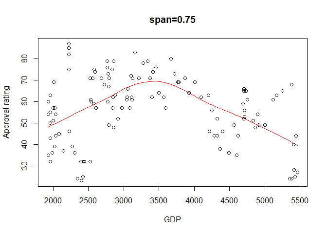

Data
====

Our data consists of presidential approval ratings, GDP, unemployment
rates, and presidential party from 1945 to 1974.

Is there any significant difference in presidential approval ratings between democratic and republican presidents?
==================================================================================================================

### Statistical Method

I will use a permutation test with the sum of approval ratings under a
democratic president as the test statistic and Wilcoxon rank-sum test
(also known as the Mann-Whitney test).

### Testing

My population is the set of all observations of approval ratings. I am
testing to see if one party’s approval rating is significantly higher
than the other. Assumptions for these procedures are taht the approval
ratings are independent and identically distributed and that the data is
paired and comes from the same population. This assumption is reasonable
because a random sample was taken from the population of U.S. citizens
each quarter.

*H*<sub>0</sub>: There is no significant difference between approval
ratings between democratic and republican presidents.

*H*<sub>*A*</sub>: There is a significant difference between approval
ratings between democratic and republican presidents.

From a 2-sample permutation test we obtain a test statistic of 3490 with
p-value 0.9151. This is based on a random sample of size 10,000 from the
permutation distribution of approval ratings.

    ## 
    ##  Wilcoxon rank sum test with continuity correction
    ## 
    ## data:  democratic.approval and republican.approval
    ## W = 1533.5, p-value = 0.9136
    ## alternative hypothesis: true location shift is greater than 0

Since our p-values are greater than *α* = 0.05, we fail to reject the
null hypothesis and conclude that there is no significant difference
between approval ratings between democratic and republican presidents.

Is there any significant differences in presidential approval ratings between quarters?
=======================================================================================

### Statistical Method

I will use a Kruskal-Wallis test to check for any significant
differences and then Tukey’s Honest Significance Difference procedure to
find specific differences in approval ratings between quarters.

### Testing

I am testing to see if approval rating differs among quarters of a
year.That is, if approval ratings are higher or lower than usual in
certain times of the year. Assumptions required are that the data is
i.i.d. which is safe to assume from the previous question.

*H*<sub>0</sub>:There is no difference in approval ratings among the
quarters of a year.

*H*<sub>*A*</sub>:There is a difference in approval ratings among the
quarters of a year.

    ## 
    ##  Kruskal-Wallis rank sum test
    ## 
    ## data:  pres$quarter and pres$approval
    ## Kruskal-Wallis chi-squared = 56.863, df = 49, p-value = 0.2056

    ## $sig
    ##       [,1]  [,2]  [,3] [,4]
    ## [1,]    NA    NA    NA   NA
    ## [2,] FALSE    NA    NA   NA
    ## [3,] FALSE FALSE    NA   NA
    ## [4,] FALSE FALSE FALSE   NA
    ## 
    ## $pvalsTij
    ##        [,1]   [,2] [,3] [,4]
    ## [1,]     NA     NA   NA   NA
    ## [2,] 0.8919     NA   NA   NA
    ## [3,] 0.8594 0.9999   NA   NA
    ## [4,] 0.4784 0.8911 0.92   NA

Tukey’s HSD test shows no significant difference between any groups
(lowest p-value: 0.4793).

Since our p-values are greater than *α* = 0.05, we fail to reject the
null hypothesis and conclude that there is no difference in approval
ratings among the quarters of a year.

Is there any monotonic relationship between presidential approval ratings and GDP?
==================================================================================

### Statistical Method

I will use a test for Spearman rank correlation since our data contains
ties. I will also use a plot with Loess Regression applied to see if the
data follows any particular pattern.

### Testing

My populations are presidential approval ratings and GDP. I am testing
to see if there is any monotonic between GDP and approval ratings. For a
Spearman rank correlation test, we assume there is a monotonic
relationship between GDP and approval ratings. This assumption is not
met looking at the plot since there is a clear non-monotonic
relationship. Since our sample size is large (n=120), I will use the
normal approximation to find the p-value.

*H*<sub>0</sub>: No association between GDP and approval ratings.

*H*<sub>*A*</sub>: Positive association between GDP and approval
ratings.

We obtain a test statistic of -0.1377827 with p-value `p.value`.

Since our p-value is greater than *α* = 0.05, we fail to reject the null
hypothesis and conclude that there is no monotonic association between
GDP and approval ratings.

The plot with Loess Regression shows a quadratic relationship:


Conclusion
==========

From my analysis, I have found that there seems to be no significant
relationship between approval ratings when compared to political party,
quarters of a year, or GDP. My results may be flawed as it is hard to
determine whether all observations are truly independent because time
and other factors must be accounted for when looking at the data
(historical events can affect some values for example).

Code Appendix
=============

``` r
setwd("C:/Users/Christopher Wong/Desktop/Projects/STA 104")
set.seed(123)
pres = read.table("pres.txt", header = TRUE)

#Problem 1
democratic.approval = pres$approval[pres$party == 1]
republican.approval = pres$approval[pres$party == 2]

pvalCalc = function(teststat, teststat.obs){
  num.GreaterThan = length(which(teststat >= teststat.obs)) 
  pval = num.GreaterThan / length(teststat)
  return(pval)
}

permTestSum = function(R, x, y){ 
  data = c(x, y)
  teststat.obs = sum(x)
  teststat = sapply(1:R, function(i){
    Sum = sum(sample(data, size = length(x), replace = FALSE))
    return(Sum)
  })
  pval = pvalCalc(teststat, teststat.obs)
  return(pval)
}

teststab.obs = sum(democratic.approval)
permTestSum(10000 ,democratic.approval, republican.approval)
wilcox.test(democratic.approval, republican.approval, alternative = "greater")

#Problem 2
#test relationship between quarters and approval rating
quarter1.approval = pres$approval[pres$quarter == 1]
quarter2.approval = pres$approval[pres$quarter == 2]
quarter3.approval = pres$approval[pres$quarter == 3]
quarter4.approval = pres$approval[pres$quarter == 4]

x = c(quarter1.approval, quarter2.approval, quarter3.approval, quarter4.approval)
grps = rep(1:4, each = 30)
k = 4

kruskal.test(pres$quarter, pres$approval)

##
###### Utility functions for Tukey HSD Permutation test for Multiple Comparisons
##
"getmaxTij" <- function(x, grps, MSE)
{
  # estimate the maximum of Tij (pairwise mean diff) of a given data x
  trtmeans = aggregate(x, list(grps), mean)
  trtmeans = trtmeans$x
  nn = table(factor(grps))
  k = length(trtmeans)
  Tijs = matrix(NA,k,k)
  for (i in 2:k) {
    for (j in 1:(i-1)){
      Tijs[i,j] = abs(trtmeans[i] - trtmeans[j])/sqrt(MSE/2 * (1/nn[i] + 1/nn[j]))
    }}
  return(max(Tijs,na.rm=T))
}

"perm.approx.maxTij" <- function(x,grps,MSE,R)
{
  ### obtain the null permutation distribution of maxTij
  results = rep(NA,R)
  for (i in 1:R) results[i] = getmaxTij(x[sample(1:(length(x)),length(x))],grps,MSE)
  return(results)
}

##
###### Tukey HSD Permutation test for Multiple Comparisons
##
"Tukey.HSD" <- function(x, grps, k, alpha=0.05, R=1000)
{
  #Tukey's HSD
  #summary(aov(x ~ factor(grps)))
  nn = table(factor(grps))
  #trtmeans = getmeans(x,grps)
  trtmeans = aggregate(x, list(grps), mean)
  trtmeans = trtmeans$x
  
  (MSE = summary(aov(x ~ factor(grps)))[[1]][2,3])
  ### observed Tij
  Tijs = matrix(NA,k,k)
  for (i in 2:k){
    for (j in 1:(i-1)){
      Tijs[i,j] = abs(trtmeans[i] - trtmeans[j])/sqrt(MSE/2 * (1/nn[i] + 1/nn[j]))
    }}
  
  ### observed maxTij
  #getmaxTij(x,grps,MSE)
  
  ### permutation maxTij
  perm.maxTij = perm.approx.maxTij(x,grps,MSE,R)
  
  pvalsTij = matrix(NA,k,k)
  for (i in 2:k){
    for (j in 1:(i-1)){
      pvalsTij[i,j] = mean(perm.maxTij >= Tijs[i,j])
    }}
  
  ### compare the pairwise pvalue with alpha
  sig = (pvalsTij <= alpha)
  
  out = list(sig=sig, pvalsTij= pvalsTij)
  return(out)
}

Tukey.HSD(x, grps, k, alpha = 0.05, R = 10000)


#Problem 3
x = pres$gdp
y = pres$approval

r.obs = cor(pres$gdp, pres$approval)
n = length(pres$gdp)
Z.value = r.obs*sqrt(n-1)
p.value = pnorm(Z.value, lower.tail = FALSE)


lo = loess(y~x, span = 0.75)
plot(y~x, main="span=0.75", xlab = "GDP", ylab = "Approval rating")
newx = seq(min(x), max(x), length=50)
pred = predict(lo, data.frame(x = newx))
lines(pred~newx, col=2, lwd=1.5)
```
