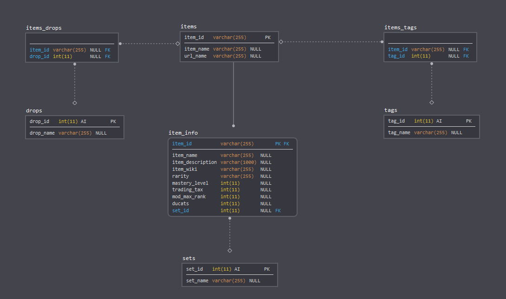

# Table of contents
1. [Introduction](#introduction)
2. [Data](#data)
3. [JSON to MySQL]({{ site.baseurl }}/projects/warframe_market/JSON_SQL/)
4. [Tableau visualization (in progress)](#tableau)

## Introduction 

Warframe is a free-to-play cooperative third-person shooter video game developed and published by Digital Extremes. In the game there exists a premium currency called Platinum which can be purchased with real money. Platinum is used to purchase in-game items such as warframes, mods, and slots. It is also the main currency used when trading items between players.

## Data 

Data was taken from the [warframe.market API](https://docs.google.com/document/d/1121cjBNN4BeZdMBGil6Qbuqse-sWpEXPpitQH5fb_Fo/edit) and contains all items traded through the website and in-game.

[SQL data]({{ site.baseurl }}/projects/warframe_market/warframe_market.sql/)
